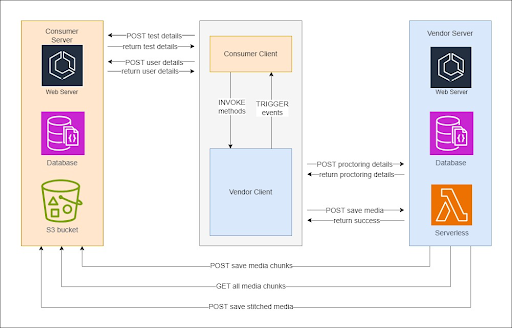
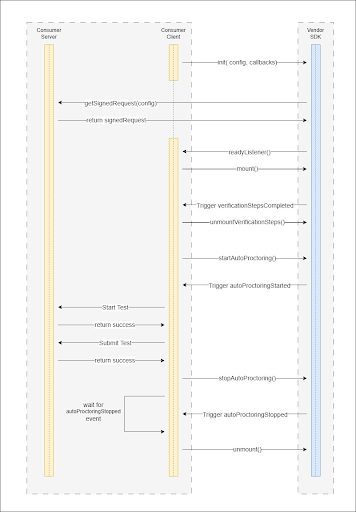
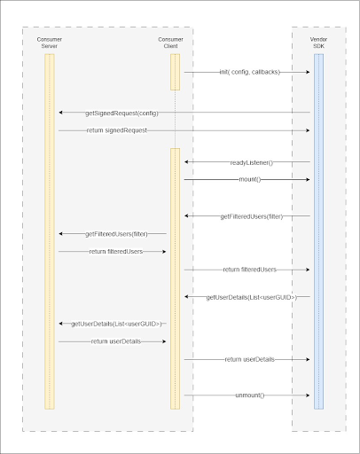

<p align="center"></p>
<h1 align="center">TestMaverick SDK</h1>

## Revision History

<table>
<thead>
<tr>
<th>Date</th>
<th>Version No</th>
<th>Author</th>
</tr>
</thead>
<tbody>
<tr>
<td>22<sup>nd</sup> September, 2023</td>
<td>1.0</td>
<td>Zeus</td>
</tr>
<tr>
<td>24<sup>th</sup> September, 2023</td>
<td>1.1</td>
<td>Zeus</td>
</tr>
<tr>
<td>20<sup>th</sup> October, 2023</td>
<td>1.2</td>
<td>Zeus</td>
</tr>
</table>

## Table of Contents

<ol>
<li> <a href="#introduction">Introduction</a> </li>
<li> <a href="#overview">Overview</a> </li>
<li> <a href="#authentication-and-security">Authentication and Security</a> </li>
<li> 
<a href="#auto-proctoring-sdk">Auto Proctoring SDK</a> 
<ol type="a">
<li> <a href="#overview-1">Overview</a></li>
<li> <a href="#sequence-diagram">Sequence Diagram</a></li>
<li> <a href="#getting-started">Getting Started</a></li>
<li> <a href="#public-methods">Public Methods</a></li>
<li> <a href="#events">Events</a></li>
<li> <a href="#integration-of-system-check">Integration of System Check</a></li>
<li> <a href="#integration-of-verification-steps">Integration of Verification Steps</a></li>
</ol>
</li>
<li> 
<a href="#auto-proctoring-report-sdk">Auto Proctoring Report SDK</a> 
<ol type="a">
<li> <a href="#overview-2">Overview</a></li>
<li> <a href="#sequence-diagram-1">Sequence Diagram</a></li>
<li> <a href="#getting-started-1">Getting Started</a></li>
<li> <a href="#public-methods-1">Public Methods</a></li>
<li> <a href="#integration-of-report-sdk">Integration of Report SDK</a></li>
</ol>
</li>
<li> <a href="#error-handling">Error Handling</a> </li>
<li> <a href="#revision-history">FAQs</a> </li>
</ol>

## Introduction

<p>
The TestMaverick SDK offers a cutting-edge solution for effortless integration of AI-based proctoring into your LMS platforms. 
</p>

<p>
With its seamless and user-friendly approach, this software development kit empowers institutions and businesses to enhance the integrity of their assessments by leveraging advanced artificial intelligence technology. 
</p>

<p>
Whether you're an educational institution, a certification body, or a business seeking to maintain the highest standards of exam security, TestMaverick SDK provides a reliable and efficient means to ensure fair and transparent testing environments.
</p>

<p>
TestMaverick SDK provides following features:
</p>

<ul>
<li>Auto Proctoring</li>
<li>Auto Proctoring Report</li>
<li>Manual Proctoring</li>
<li>Test player</li>
<li>Smart Test evaluation using ChatGPT</li>
<li>Plagiarism Check</li>
</ul>

<p>This document covers Auto Proctoring and Auto Proctoring Report SDK features.</p>

## Overview

<p>
Below is a top level architectural overview of TestMaverick SDK integration with Consumer’s existing system. 
</p>

<p>
The TestMaverick Client SDK will be integrated into the Consumer system, allowing it to communicate with the system for data through callbacks and event triggers. Additionally, TestMaverick SDK provides a list of publicly accessible methods that can be invoked by the consumers.
</p>

<p>
The TestMaverick SDK will store all the Proctoring related information on TestMaverick Server however it will not  store any PII or sensitive information of the user on our server. TestMaverick SDK solely store statistical data related to auto proctoring (i.e Face, audio and browser related violation counts) along with few non-identifiable GUIDs like userGUID, testGUID and attemptGUID, ensuring that no personal information is stored on our end. These identifiers, which are not directly linked to personal information, are essential for keeping the data mapping within the TestMaverick system so that when the TestMaverick Report SDK is loaded in your system, using these non-identifiable GUIDs it will accurately retrieve statistical information mapped to it from our TestMaverick server.
</p>

<p align="center">

</p>

------

## Authentication and Security

<p>
TestMaverick SDK provides a signature based authentication and authorization system to integrate with various existing applications to ensure the security of our APIs. 
</p>

### Steps to integrate Testmaverick SDK in Consumer's existing system.
#### 1. Registration and Configuration
* <p>To use the TestMaverick SDK, consumers must register with our service. Upon registering, they will receive a 'ClientID' and a 'Secret Key'. This set of secret keys needs to be kept confidential.</p>


#### 2. Add Signature API
* Consumers must provide an API which can generate the signed object in the following output format.<br/>

```json
    {
        "security": {
            "consumerKey": "xxxxxxxx",
            "domain": "xxxxxxxx",
            "timestamp": "xxxxxx",
            "signature": "xxxxxxxxxxxxxxxxxxxxxxxxxxxxxx",
            "remoteIpAddress": "xxx.xxx.xxx.xxx"
            },
        "request": {
        "mode": "xxxx",
        "user": {
            "id": "xxxxx",
            "firstName": "xxxxx",
            "lastName": "xxxxx",
            "email": "xxxxx",
        },
        "meta": "xxxxx"
        },
        "userRequest": {
        "ClientUserGUID": "xxxx",
        "OrganizationID": "xxxxx",
        "ClearanceLevel": "xxxxx"
        }
    }
```

* To create the above signed object, consumers can use TestMaverick.SDK.Security.dll provided by the TestMaverick vendor.
* For .Net core applications following changes can be done to create an API for signed requests.

* <p>Consumer should add reference of dll to their project<br/></p>

```javascript
<ItemGroup>
  <Reference Include="TestMaverick.SDK.Security">
    <HintPath>".\Lib\TestMaverick.SDK.Security.dll</HintPath>
  </Reference>
</ItemGroup>
```

* <p>Create a new web API in your application which will be used by Testmaverick SDK to generate a signed request. This web API endpoint URL will be provided in the config while initializing the SDK. The definition of the Signature API is given below for your reference.

    - Type : POST
    - Request Param : [FromBody] object config
    - <p>Sample Code: <br/></p>

```c#
public async Task<ActionResult> GetSdkSignedRequestObject([FromBody] object config)
        {


            // Add your logic to call a service which will create a signature for a given request object.
            // Object signedRequest = GetSignedReq();   // This is sample call
            // Then return API response in following data structure

            Object responseData = new Object();
            responseData.responseObject = signedRequest;
            responseData.statusCode = 0;

            ContentResult contentResult = new ContentResult();
            contentResult.ContentType = "application/json";
            contentResult.Content =  
            JsonSerialize.Serializer(responseData);
            return contentResult;
        }
```

* To create a signed request object use the following method provided with dll.

```c#
public Class YourBusinesLogicClass {
    ...
    ...
    ...
    // Add this method to you code
    public Task<SignRequestModel> getSignedRequest(Object meta) {
        
        // Sample data for meta param
        // meta = '{\"attemptGUID\":\"c365a912-031b-495d-2c22-15c5d1c48d58\",\"userGUID\":\"e94ca06b-eb21-11ec-9b97-0a264b1a6b74\",\"testGUID\":\"293a30c8-59de-477c-8fc6-2d34b893cd25\",\"type\":\"verification-steps\"}' 
        

        HMACService hMACService = new HMACService();
        // Populate user information object
        SignRequestRequestParameterUserDetails userDetails = new requestRequestParameterUserDetails("yourUserUniqueId", 0, "first_name",  “abc@useremail.com”, “user_last_name”);
       
        // Populate input request object
        SignRequestRequestParameter requestParameter = new SignRequestRequestParameter("launch_mode", userDetails, meta);

        // Populate Security object for signature generation
        SignRequestSecurityParameter security = new SignRequestSecurityParameter("yourConsumerKey", "yourDomain", 1234567890, "IP address of requesting client");

        //  Populate input data model for the signature generation
        SignRequestModel signRequestModel = new SignRequestModel(security, requestParameter);


        // Pass the above input model to create signature using dll
        return await hMACService.CreateHMACSignature(signRequestModel, "secret");
     }
     ...
     ...
     ...
}
```
* Consumers should make sure that the web API added in this step is not a public API to avoid any unauthorized access.

#### 3. SDK initialization
* The TestMaverick SDK provides the init method for initializing the SDK with required configuration based on consumers requirement. <b><u>This  method requires two parameters as given below:</u></b>

<table>
<thead>
<tr>
<th>input parameters</th>
<th>type</th>
<th>schema</th>
</tr>
</thead>
<tbody>
</tbody>
<tr>
<td>initConfig</td>
<td>object</td>
<td>

```
{
    {
        attemptGUID: `string`,
        userGUID: `string`,
        testGUID: `string`,
        type : `string`
    },
    `authURL ` : `string`
}
```
</td>
</tr>
<tr>
<td>callbacks </td>
<td>object</td>
<td>

```
{
    readyListener: function,
    errorListener: function
}
```
</td>
</tr>
</table>

<strong>Sample code :</strong>

```javascript
const initConfig  = {
   config: {
      attemptGUID : “7557fc68-fc1a-4755-b58e-9f6055fcebe8”
      userGUID : “dc49115b-e655-11ec-9b97-0a264b1a6b74”,
      testGUID : “xyz” ,
      type : “verification-steps”
   },
   authURL : “<consumers signed request web API URL>”
 }

const readyListener = function() {
    // sdk is initalized
}

const errorListener = function(error) {
    // perform error handling here
}

// initialize the SDK using above config
window.Testmaverick.AutoProctoring.init(
    initConfig ,
    {
       readyListener,
       errorListener
    }
)
```
------

## Auto Proctoring SDK

### Overview
* Auto Proctoring SDK ensures the utmost exam security by meticulously scrutinizing audio-video and screen-sharing data to mimic the vigilance of a human proctor, proactively identifying and flagging any potential violations during the exam.
* This system smartly compiles all the concrete evidence in cases of suspicious behavior, creating a solid basis for subsequent investigative procedures.

## Sequence Diagram
<p align="center">

</p>

## Getting Started

<p>Download the following files and add them to your public directory of your client application.</p>
<table>
<thead>
<tr>
<th>Script files</th>
<th>URL</th>
</tr>
</thead>
<tbody>
<tr>
<td>jsstore-worker.js</td>
<td><a href="https://sandbox.testmaverick.com/v2023.11.1/static-resource/js/worker/jsstore-worker.js" target="_blank">https://sandbox.testmaverick.com/v2023.11.1/static-resource/js/worker/jsstore-worker.js</a></td>
</tr>
<tr>
<td>media-upload-worker.js</td>
<td><a href="https://sandbox.testmaverick.com/v2023.11.1/tatic-resource/js/worker/media-upload-worker.js" target="_blank">https://sandbox.testmaverick.com/v2023.11.1/tatic-resource/js/worker/media-upload-worker.js</a></td>
</tr>
<tr>
<td>signalr.js</td>
<td><a href="https://sandbox.testmaverick.com/v2023.11.1/static-resource/js/scripts/signalr.js" target="_blank">https://sandbox.testmaverick.com/v2023.11.1/static-resource/js/scripts/signalr.js</a></td>
</tr>
<tr>
<td>background-socket-service.js</td>
<td><a href="https://sandbox.testmaverick.com/v2023.11.1/static-resource/js/scripts/background-socket-service.js" target="_blank">https://sandbox.testmaverick.com/v2023.11.1/static-resource/js/scripts/background-socket-service.js</a></td>
</tr>
</tbody>
</table>

<br/>
<p>Add below scripts in your index.html</p>

```html
<link rel="stylesheet" href="https://sandbox.testmaverick.com/v2023.11.1/static-resource/sdk/auto-proctoring/auto-proctoring-sdk.css"/>
<script src="https://sandbox.testmaverick.com/v2023.11.1/static-resource/sdk/auto-proctoring/auto-proctoring-sdk.js"></script>
```

<p>Add div elements in your DOM with below shown identifiers:</p>

<ol>
<li>
<b>For System Check</b>

```html
<div id=”system-check-steps-container”> </div>
```
</li>
<li>
<b>For Verification Steps and Auto Proctoring</b>

```html
<div :class="isVerificationSteps: '': 'display-none'" >
    <div id="verification-steps-container"></div>
</div>


<div :class="!isVerificationSteps: '': 'display-none'">
    <TestPlayer /> <!-- Put Your Testplayer code or component here  -->
    <div id="auto-proctoring-container"></div>
</div>
```
</li>
</ol>

<p>After adding these references your index.html file should look as below.</p>

`index.html`
```html
<!DOCTYPE html>
<html lang="en">
  <head>
    <meta charset="UTF-8" />
    <meta name="viewport" content="width=device-width, initial-scale=1.0" />
    <!-- Add SDK CSS BUNDLE FILE HERE -->
    <link rel="stylesheet" href="https://sandbox.testmaverick.com/v2023.11.1/static-resource/sdk/auto-proctoring/auto-proctoring-sdk.css"
    />
    <!-- Add SDK JS BUNDLE FILE HERE -->
    <script src="https://sandbox.testmaverick.com/v2023.11.1/static-resource/sdk/auto-proctoring/auto-proctoring-sdk.js"
    ></script>
    <title>Auto Proctoring SDK Integration Example</title>
  </head>

  <body>
     <div :class=’isVerificationSteps? “”: “display-none“’ >
        <div id="verification-steps-container"></div>
     </div>
     <div :class=’!isVerificationSteps? “”: “display-none“’>
        <TestPlayer /> <!-- Put Your Testplayer code or component here  -->
        <div id="auto-proctoring-container"></div>
     </div>
  </body>
</html>
```
## Public Methods

### init(initConfig, callbacks)

<ul>
<li>The SDK will be initialized using the initConfig provided.</li>
<li>One of the available callbacks will be triggered depending on whether initialization was successful or unsuccessful.</li>
<li>The SDK's initialization configuration must contain an authURL.</li>
</ul>

<strong>Arguments:</strong>

`1. initConfig`
```typescript
initConfig : Object{
    config : Object {
        testGUID : Integer (Required),
        userGUID : Integer (Required),
        attemptGUID : String (Required only if type is verification-steps),
        type : String (Required) VALUE CAN BE ("system-check" , "verification-steps")
    },
    authURL : String (Required)
}
```

`2. callbacks`
<table>
<thead>
<tr>
<th>Function name</th>
<th>Required</th>
<th>Description</th>
<th>Parameter</th>
<th>Parameter Example</th>
<th>Return Value</th>
</tr>
</thead>
<tbody>
<tr>
<td>readyListener()</td>
<td>True</td>
<td>This listener will be triggered when the SDK has been successfully initialized.</td>
<td> - </td>
<td> - </td>
<td> - </td>
</tr>

<tr>
<td>errorListener(error)</td>
<td>True</td>
<td>This listener will be triggered when there is any error while initializing the SDK or at any point when the SDK is running. <br/>
It will provide an error code with a descriptive message to handle the error accordingly.</td>
<td> 

`error` : `string`
 </td>
 <td> - </td>
<td> - </td>
</tr>

<tr>
<td>getUserDetails(List<userGUID>)</td>
<td>True <b>if type is “verification-steps”</b></td>
<td>This callback function will get called whenever there is need of personal data to render in sdk like first name, last name or email</td>
<td> 

`List<userGUID>` : `List<string>`
 </td>
 <td>

 ```javascript
 [
    "99a6bb35-b740-4021-b2b4-d712901bf91b"
]

 ```
 </td>
 <td>

 ```json
 [
    {
       "userGUID" :   "99a6bb35-b740-4021-b2b4-d712901bf91b",
       "firstName" : "John",
       "lastName" : "Doe",
       "email" : "johndoe@gmail.com"
    }
]


 ```
 </td>
</tr>
</tbody>
</table>

### mount()

<p>The UI Components will be mounted using this method based on the “type” parameter provided in the config while initialization.</p>

<b>Arguments :</b> 
`None`<br/>

<b>Return value :</b> 
`None`<br/>

<strong>Example :</strong>

```javascript
 window.Testmaverick.AutoProctoring.mount();
```

### unmountVerificationSteps()

<p>This method will unmount all the UI components related to verification steps that were mounted in the DOM.</p>

<b>Arguments :</b> 
`None`<br/>

<b>Return value :</b> 
`None`<br/>

<strong>Example :</strong>

```javascript
 window.Testmaverick.AutoProctoring.unmountVerificationSteps();
```

### unmountProctorPlayer()

<p>This method will unmount all the UI components related to auto proctoring that were mounted in the DOM.</p>

<b>Arguments :</b> 
`None`<br/>

<b>Return value :</b> 
`None`<br/>

<strong>Example :</strong>

```javascript
 window.Testmaverick.AutoProctoring.unmountProctorPlayer();
```

### startAutoProctoring()

<ul>
<li>This method will start auto proctoring services.</li>
<li>It will trigger the autoProctoringStarted event on successfully starting the auto proctoring.</li>
</ul>

<b>Arguments :</b> 
`None`<br/>

<b>Return value :</b> 
`None`<br/>

<strong>Example :</strong>

```javascript
  window.TestMaverick.AutoProctoring.startAutoProctoring();
```

### stopAutoProctoring(submitTest)
<ul>
<li>This method will be used to stop auto proctoring..</li>
<li>Auto proctoring data will be submitted if this submitTest flag is set to true or else an proctoring attempt will be saved which can be further resumed.</li>
<li>Once auto proctoring is stopped without any errors, “autoProctoringStopped” event will be triggered by the SDK.</li>
</ul>

<b>Arguments :</b> 
`submitTest` : `Boolean` (Default : True)<br/>

<b>Return value :</b> 
`None`<br/>

<strong>Example :</strong>

```javascript
   window.Testmaverick.AutoProctoring.stopAutoProctoring(submitTest);
```
### toggleWebcamPreview()

<p>This method will be used to open or close the webcam preview during the proctoring.</p>

<b>Arguments :</b> 
`None`<br/>

<b>Return value :</b> 
`None`<br/>

<strong>Example :</strong>

```javascript
  window.TestMaverick.AutoProctoring.toggleWebcamPreview();
```

### getErrorLogs()

<p>This method will return a list of error logs that occurred during the functioning of SDK.</p>

<b>Arguments :</b> 
`None`<br/>

<b>Return value :</b> 
`List<Object>`<br/>

<strong>Example :</strong>

```javascript
  let errorLogs = window.TestMaverick.AutoProctoring.getErrorLogs();
 console.log(errorLogs);
 /* 
 OUTPUT
 [
 	{
    	name: “ValidationError”,
    	code: 1202,
    	stack : “ValidationError: Error in callback arguments. . .  ”,
    	message : “Error in callback arguments.”
 	}
 ]
 */
```

## Events

### verificationStepsExited : 
<p>This event will be triggered when the user exits verification steps by clicking on the exit button.</p>

### globalSystemCheckCompleted:
<p>This event will be emitted when the system-check steps are successfully completed.</p>

### verificationStepsCompleted:
<ul>
<li>When the user successfully completes the verification stages, this event will be triggered.</li>
<li>On listening to this event, the consumer can either start auto-proctoring or perform any other tasks before starting the test.</li>
</ul>

### autoProctoringStarted:
<p>This event is triggered when auto proctoring is started without any errors. </p>

### autoProctoringAborted:
<ul>
<li>This event will be triggered if an interference, like a webcam stream being closed while proctoring, causes the auto proctoring to stop working.</li>
<li>If the user wants to resume proctoring, they must again complete the verification steps by executing method mount("verification-steps" type) before resuming the test.</li>
</ul>

### autoProctoringStopped:
<p>This event is triggered when auto proctoring is stopped without any errors.</p>

## Integration of System Check

<ol>

### <li>Initialize the SDK</li>

```javascript
function subscribeToEvents(){
    window.TestMaverick.AutoProctoring.on(
         "globalSystemCheckCompleted", () => {
          // code here
    });
   window.TestMaverick.AutoProctoring.on(
         "verificationStepsExited", () => {
         // code here
   });
 }


function readyListener(){
subscribeToEvents();
}


function errorListener(error){
// handle error here
}


const initConfig = {
    config: {
        userGUID,
        testGUID,
        “system-check”
    },
    authURL : “<Consumer’s signed request web API url>”
}


// initialize the SDK using above config
 window.Testmaverick.AutoProctoring.init(
    initConfig ,
    {
       readyListener,
       errorListener
    }
 )
```
</ol>

### <li>Mount SystemCheck component</li>

In order to mount the system check UI components, there must be an element with the below mentioned identifier present in the DOM.

```html
<div id=”system-check-steps-container”> </div>
```
update ready listener callback as shown below

```javascript
function readyListener(){
    subscribeToEvents();
        // add this line
    window.Testvaverick.AutoProctoring.mount();
}
```

## Integration of Verification Steps

<ol>

### <li>Initialize the SDK</li>

```javascript
function subscribeToEvents(){
  window.TestMaverick.AutoProctoring.on(
        "verificationStepsCompleted", () => {
         // code here
  });
  window.TestMaverick.AutoProctoring.on(
        "verificationStepsExited", () => {
        // code here
  });
  window.TestMaverick.AutoProctoring.on(
      "autoProctoringStarted", () => {
       // code here
  });
  window.TestMaverick.AutoProctoring.on(
      "autoProctoringAborted", () => {
       // code here
  });
  window.TestMaverick.AutoProctoring.on(
      "autoProctoringStopped", () => {
       // code here
    });
}

function readyListener(){
    subscribeToEvents();
}

function errorListener(error){
 // handle error here
 }


function getUserDetails(List<userGUID>){
    let userDetails = {}
    // code to get user details here
    return useDetails;
}


const initConfig = {
  config: {
    attemptGUID,
    userGUID,
    testGUID,
    "verification-steps"
    },
  authURL : “<Consumer’s signed request web API url>”
 }


// This method will initialize TestMaverick SDK
window.TestMaverick.AutoProctoring.init(
    initConfig ,{
    readyListener,
    errorListener,
    getUserDetails
})
```
### <li>Mount Verification Steps Component</li>

In order to mount the system check UI components, there must be an element with the below mentioned identifier present in the DOM.

```vue
<div :class="isVerificationSteps: '': 'display-none'" >
    <div id="verification-steps-container"></div>
</div>


<div :class="!isVerificationSteps: '': 'display-none'">
    <TestPlayer />
    <div id="auto-proctoring-container"></div>
</div>
```
update ready listener callback as shown below

```javascript
function readyListener(){
    subscribeToEvents();
    window.Testmaverick.AutoProctoring.mount();
    isVerificationSteps = true;
}
```

### <li>Start Auto Proctoring</li>

```javascript
function startAutoProctoring() {
     window.Testmaverick.AutoProctoring.startAutoProctoring()
}

function subscribeToEvents(){   
   window.Testmaverick.AutoProctoring.on(
      "verificationStepsCompleted", () => {
         window.Testmaverick.AutoProctoring.unmountVerificationSteps();
         startAutoProctoring();
    });

   window.TestMaverick.AutoProctoring.on(
        "autoProctoringStarted", () => {
        isVerificationSteps = false;
   });
}
```
### <li>Stop Auto Proctoring</li>

```javascript
function subscribeToEvents(){
    window.TestMaverick.AutoProctoring.on(
       "autoProctoringStopped", () => {
         // code here     
    });
}


function stopAutoProctoring() {
    let submitTest = true;
    window.TestMaverick.AutoProctoring.stopAutoProctoring(submitTest );
};
```
</ol>


# Auto Proctoring Report SDK

## Overview

<ul>
    <li>The AutoProctoring Report SDK is a powerful tool built to give a deep look into online test proctoring.</li>
    <li>It helps proctors keep a close eye on how candidates behave during online exams, making the process more efficient.</li>
    <li>This SDK easily fits into existing online testing platforms and brings a bunch of useful features to enhance the proctoring experience.</li>
</ul>

## Sequence Diagram

<p align="center">

</p>


## Getting started

Add below scripts in your index.html

```html
<link rel="stylesheet" href="https://sandbox.testmaverick.com/v2023.11.1/static-resource/sdk/report-sdk/report-sdk.css"/>
<script src="https://sandbox.testmaverick.com/v2023.11.1/static-resource/sdk/report-sdk/report-sdk.js"></script>
```

Add div elements in your DOM with below shown identifiers:

```html
<div id=”reports-container”> </div>
```

After adding these references your index.html file should look as below.

`index.html`
```html
<!DOCTYPE html>
<html lang="en">
  <head>
    <meta charset="UTF-8" />
    <meta name="viewport" content="width=device-width, initial-scale=1.0" />
    <!-- Add SDK CSS BUNDLE FILE HERE -->
    <link rel="stylesheet" href="https://sandbox.testmaverick.com/v2023.11.1/static-resource/sdk/report-sdk/report-sdk.css"/>
    <!-- Add SDK JS BUNDLE FILE HERE -->
    <script src="https://sandbox.testmaverick.com/v2023.11.1/static-resource/sdk/report-sdk/report-sdk.js"></script>
    <title>Report SDK Integration Example</title>
  </head>

  <body>
      <div id=”reports-container”> </div>
  </body>
</html>
```

## Public Methods

### init(initConfig, callbacks)

<ul>
<li>The SDK will be initialized using the initConfig provided.</li>
<li>One of the available callbacks will be triggered depending on whether initialization was successful or unsuccessful.</li>
<li>The SDK's initialization configuration must contain an authURL.</li>
</ul>

<strong>Arguments:</strong>

`1. initConfig`
```typescript
initConfig : Object{
    config : Object {
        currentUserGUID : Integer (Required),
        TestDetailsList: List<    (Required)
                {
                    testGUID: String,
                    testDateTime: Integer,
                    testName: String,
                    testDuration: Integer
                }> 
    },
    authURL : String (Required)
}
```

`2. callbacks`
<table>
<thead>
<tr>
<th>Function name</th>
<th>Required</th>
<th>Description</th>
<th>Parameter</th>
<th>Parameter Example</th>
<th>Return Value</th>
</tr>
</thead>
<tbody>
<tr>
<td>readyListener()</td>
<td>True</td>
<td>This listener will be triggered when the SDK has been initialized and is ready for the further steps.</td>
<td> - </td>
<td> - </td>
<td> - </td>
</tr>

<tr>
<td>errorListener(error)</td>
<td>True</td>
<td>This listener will be triggered when there is any error while initializing the SDK or at any point when the SDK is running. <br/>
It will provide an error code with a descriptive message to handle the error accordingly.</td>
<td> 

`error` : `string`
 </td>
 <td> - </td>
<td> - </td>
</tr>

<tr>
<td>getFilteredUsers(filter)</td>
<td>True</td>
<td>This call back function will get called whenever there is a need to search or sort candidates by name.</td>
<td> 

`filter` : `Object`
 </td>
 <td>

 ```javascript
 {
    searchKeyword : "joe"
    sortBy : true;
    pageNo : 1;
    perPageRowCount : 20;
    oldPerPageRowCount : 20 ;
    testGUID: "a2a00246-2653-4d8f-bbeb-13aa8cf83ae8"
}
 ```
 </td>
 <td>

 ```json
 [
   "99a6bb35-b740-4021-b2b4-d712901bf91b",
   "804e7e24-f588-4a97-a812-f387639e5b09"
]
 ```
 </td>
</tr>

<tr>
<td>getUserDetails(List<userGUID>)</td>
<td>True</td>
<td>This call back function will get called whenever there is need of personal data to render in sdk like first name, last name or email</td>
<td> 

`List<userGUID>` : `List<string>`
 </td>
 <td>

 ```javascript
    [
        "99a6bb35-b740-4021-b2b4-d712901bf91b", 
        "804e7e24-f588-4a97-a812-f387639e5b09"
    ]

 ```
 </td>
 <td>

 ```javascript
 [
    {
       userGUID :"99a6bb35-b740-4021-b2b4-d712901bf91b",
       firstName : "John",
       lastName : "Doe",
       email : "johndoe@gmail.com"
    },
    {
       userGUID :"804e7e24-f588-4a97-a812-f387639e5b09",
       firstName : "John",
       lastName : "snow",
       email : "johnsnow@gmail.com"
    }]
 ```
 </td>
</tr>
</tbody>
</table>

### mount()

The Report component will be mounted using this method.

<b>Arguments :</b> 
`None`<br/>

<b>Return value :</b> 
`None`<br/>

<strong>Example :</strong>

```javascript
  window.TestMaverick.AutoProctoringReport.mount();
```

### getErrorLogs()

This method will return a list of error logs that occurred during the functioning of SDK.

<b>Arguments :</b> 
`None`<br/>

<b>Return value :</b> 
`List of Object`<br/>

<strong>Example :</strong>

```javascript
  let errorLogs = window.TestMaverick.AutoProctoring.getErrorLogs();
 console.log(errorLogs);
 /* OUTPUT
 [
    {
        name: “ValidationError”,
        code: 1202,
        stack : “ValidationError: Error in callback arguments. . .  ”,
        message : “Error in callback arguments.”
    }
 ]
 */
```

## Integration of Report SDK

<ol>

### <li>Initialize the SDK</li>
```javascript
function readyListener(){
    subscribeToEvents();
}
function errorListener(error){
    console.log(error);
}
function getFilteredUsers(filter) {
    /*
    filter = {
        "searchKeyword": "anything",
        "sortBy": true,
        "pageNo": 0,
        "perPageRowCount": 20,
        "oldperPageRowCount": -1,
        "testGUID": “abcd”
    }
    */
    const userData = // fetch data based on filter
    return userData;
}
function getUserDetails(List<userGUID>) {
    let userDetails= [];
    return userDetails
}
const initConfig = {
    config : {
        currentUserGUID: “b96c5038-ecb5-11ec-9b97-0a264b1a6b74”,
        testDetailsList:[{
            testGUID: "293a30c8-59de-477c-8fc6-2d34b893cd25",
            testDateTime: "1697459863067",
            testName: "Zeus Recruitment Test",
            testDuration: 210
        }]
    },
    authURL : "<Consumer’s signed request web API url>"
}
// initialize the SDK using above config
function initializeSDK(){
    window.TestMaverick.AutoProctoringReport.init(
        initConfig ,
        {
            readyListener,
            errorListener,
            getFilteredUsers,
            getUserDetails
        })
}
```
</ol>

### <li>Mount ReportSDK component</li>

In order to mount the report UI components, there must be an element with the below mentioned identifier present in the DOM.

```html
<div id="reports-container"></div>
```

update ready listener callback as shown below

```javascript
function readyListener(){
    subscribeToEvents();
    // add this line
    window.TestMaverick.AutoProctoringReport.mount();
}
```

# Error handling

<ol>
<li>Each error  will have an error code, error message, and error stack trace to help you in debugging.</li>
<li>All the errors thrown from the SDK will be passed to the errorListener callback and will also be logged in the browser console.</li>
<li>The getErrorLogs method of the SDK can be used to get the complete list of errors that have occurred from the point of SDK initialization.</li>
<li>Below is a comprehensive list of error codes with a descriptive message for troubleshooting.</li>
</ol>

<table>
    <thead>
    <tr>
        <th>Error Category</th>
        <th>Error Code</th>
        <th>Message for Users</th>
    </tr>
    </thead>
    <tbody>
    <tr>
        <td rowspan="4">SDK configuration errors</td>
        <td>1001</td>
        <td>required config not provided</td>
    </tr>
    <tr>
        <td>1002</td>
        <td>required config parameters are missing</td>
    </tr>
    <tr>
        <td>1003</td>
        <td>incompatible config is provided</td>
    </tr>
    <tr>
        <td>1004</td>
        <td>config validation failed</td>
    </tr>
    <tr>
        <td rowspan="8">SDK service errors</td>
        <td>1102</td>
        <td>service is already running</td>
    </tr>
    <tr>
        <td>1102</td>
        <td>service is already running</td>
    </tr>
    <tr>
        <td>1103</td>
        <td>service not running</td>
    </tr>
    <tr>
        <td>1104</td>
        <td>service failed to start</td>
    </tr>
    <tr>
        <td>1105</td>
        <td>service invalid request</td>
    </tr>
    <tr>
        <td>1106</td>
        <td>service authentication failure</td>
    </tr>
    <tr>
        <td>1107</td>
        <td>service rate limit exceeded</td>
    </tr>
    <tr>
        <td>1108</td>
        <td>service internal error</td>
    </tr>
    <tr>
        <td rowspan="3">Consumer callback errors</td>
        <td>1201</td>
        <td>callbacks not provided</td>
    </tr>
    <tr>
        <td>1202</td>
        <td>required callback not provided</td>
    </tr>
    <tr>
        <td>1203</td>
        <td>callback execution failed</td>
    </tr>
    <tr>
        <td rowspan="6">Browser permission errors</td>
        <td>1301</td>
        <td>browser not supported</td>
    </tr>
    <tr>
        <td>1302</td>
        <td>browser version is not supported</td>
    </tr>
    <tr>
        <td>1303</td>
        <td>browser permission are not granted</td>
    </tr>
    <tr>
        <td>1304</td>
        <td>Camera permission is not granted</td>
    </tr>
    <tr>
        <td>1305</td>
        <td>Microphone permission is not granted</td>
    </tr>
    <tr>
        <td>1306</td>
        <td>window management permission is not granted</td>
    </tr>
    <tr>
        <td rowspan="2">Internet connectivity errors</td>
        <td>1401</td>
        <td>Internet insufficient bandwidth</td>
    </tr>
    <tr>
        <td>1402</td>
        <td>No Internet</td>
    </tr>
    <tr>
        <td rowspan="7">Screen related errors</td>
        <td>1501</td>
        <td>Multiple Screen detected</td>
    </tr>
    <tr>
        <td>1502</td>
        <td>Screen Share Stopped</td>
    </tr>
    <tr>
        <td>1503</td>
        <td>Error while starting ScreenShare Video</td>
    </tr>
    <tr>
        <td>1504</td>
        <td>Error while Requesting Screen Share stream</td>
    </tr>
    <tr>
        <td>1505</td>
        <td>Full Screen is not shared</td>
    </tr>
    <tr>
        <td>1506</td>
        <td>Valid Screen is not Shared</td>
    </tr>
    <tr>
        <td>1507</td>
        <td>Screen Share denied</td>
    </tr>
    <tr>
        <td rowspan="5">Webcam errors</td>
        <td>1601</td>
        <td>Error while starting webcam</td>
    </tr>
    <tr>
        <td>1602</td>
        <td>Error while requesting stream from webcam</td>
    </tr>
    <tr>
        <td>1603</td>
        <td>No webcam found</td>
    </tr>
    <tr>
        <td>1604</td>
        <td>Not readable webcam</td>
    </tr>
    <tr>
        <td>1605</td>
        <td>Webcam is already in use</td>
    </tr>
    <tr>
        <td>Hardware errors</td>
        <td>1701</td>
        <td>Hardware acceleration not enabled</td>
    </tr>
    <tr>
        <td rowspan="6">Microphone errors</td>
        <td>1801</td>
        <td>Error while requesting audio stream</td>
    </tr>
    <tr>
        <td>1802</td>
        <td>No microphone found</td>
    </tr>
    <tr>
        <td>1803</td>
        <td>Microphone is not readable</td>
    </tr>
    <tr>
        <td>1804</td>
        <td>No audio detected from microphone stream</td>
    </tr>
    <tr>
        <td>1805</td>
        <td>Speech Recognition failed</td>
    </tr>
    <tr>
        <td>1806</td>
        <td>Microphone audio stream is not available</td>
    </tr>
    <tr>
        <td>Browser extension errors</td>
        <td>1901</td>
        <td>Extension detected</td>
    </tr>
    <tr>
        <td rowspan="4">Auto Proctoring errors</td>
        <td>3001</td>
        <td>Webcam disconnected while proctoring</td>
    </tr>
    <tr>
        <td>3002</td>
        <td>Microphone disconnected while proctoring</td>
    </tr>
    <tr>
        <td>3003</td>
        <td>Screen share stopped while proctoring</td>
    </tr>
    <tr>
        <td>3004</td>
        <td>Browser permission toggled while proctoring</td>
    </tr>
    <tr>
        <td rowspan="8">SDK initialization errors</td>
        <td>3101</td>
        <td>Error while checking window for resize</td>
    </tr>
    <tr>
        <td>3102</td>
        <td>Error while handling Tab switch detection</td>
    </tr>
    <tr>
        <td>3103</td>
        <td>Error while starting Tab switch detection</td>
    </tr>
    <tr>
        <td>3104</td>
        <td>Error while stopping Tab switch detection</td>
    </tr>
    <tr>
        <td>3501</td>
        <td>Auto Proctoring is not Initialized</td>
    </tr>
    <tr>
        <td>3502</td>
        <td>No selector provided for Auto Proctoring</td>
    </tr>
    <tr>
        <td>3601</td>
        <td>Verification steps is not initialized</td>
    </tr>
    <tr>
        <td>3602</td>
        <td>No selector is Provided for Verification steps.</td>
    </tr>
    <tr></tr>
    </tbody>
</table>
