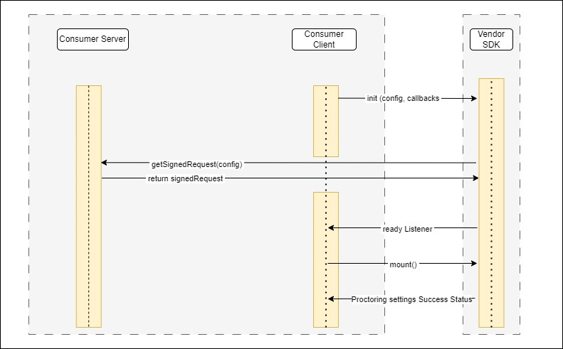

<h1 align="center">TestMaverick SDK Integration</h1>
[TODO : Add Image here]
<p align="left"></p>
Zeus learning | B-1402, Peninsula Business Park, Lower Parel (W), Mumbai 400013, India


# Revision History

<table>
<thead>
<tr>
<th>Date</th>
<th>Version No</th>
<th>Author</th>
<th>Comments</th>
</tr>
</thead>
<tbody>
<tr>
<td>10<sup>th</sup> Nov, 2023</td>
<td>v2023.11.1</td>
<td>Zeus</td>
<td>SDK Overview and Integration steps</td>
</tr>
<tr>
<td>28<sup>th</sup> Nov, 2023</td>
<td>v2023.11.28</td>
<td>Zeus</td>
<td>Change the path for client scripts</td>
</tr>
<tr class="odd">
<td>29<sup>th</sup> Nov, 2023</td>
<td>v2023.11.29</td>
<td>Zeus</td>
<td>Update details related to response object of Auth API</td>
</tr>
<tr class="header">
<td>4<sup>th</sup> Dec, 2023</td>
<td>v2023.12.04</td>
<td>Zeus</td>
<td>Add notes</td>
</tr>
<tr class="odd">
<td>5<sup>th</sup> Dec, 2023</td>
<td>v2023.12.05</td>
<td>Zeus</td>
<td>Fix typo errors in code snippet</td>
</tr>
<tr class="header">
<td>11<sup>th</sup> Dec, 2023</td>
<td>v2023.12.11</td>
<td>Zeus</td>
<td>Add documentation for Proctoring Settings</td>
</tr>
<tr class="odd">
<td>14<sup>th</sup> Dec, 2023</td>
<td>v2023.12.14</td>
<td>Zeus</td>
<td>Update Report SDK config</td>
</tr>
<tr class="header">
<td>5<sup>th</sup> Jan, 2024</td>
<td>v2024.01.05</td>
<td>Zeus</td>
<td>Add documentation for Proctoring Setting SDK</td>
</tr>
<tr class="odd">
<td>16<sup>th</sup> Jan,2024</td>
<td>v2024.01.16</td>
<td>Zeus</td>
<td>Add documentation for webhook and auth api changes</td>
</tr>
<tr class="header">
<td>19<sup>th</sup> Jan,2024</td>
<td>v2024.01.19</td>
<td>Zeus</td>
<td><p>Add customHeaders field in SDK initialization</p>
<p>and rename userGUID field</p></td>
</tr>
<tr class="odd">
<td>1st Feb, 2024</td>
<td>v2024.02.01</td>
<td>Zeus</td>
<td>Add “listOfIFrames” field in Auto Proctoring SDK initialization.</td>
</tr>
<tr class="header">
<td>7<sup>th</sup> Feb, 2024</td>
<td>v2024.02.02</td>
<td>Zeus</td>
<td>Update flag for Iframe and Event management for iframe window in Auto Proctoring SDK.</td>
</tr>
<tr class="odd">
<td>20<sup>th</sup> Feb, 2024</td>
<td>v2024.02.20</td>
<td>Zeus</td>
<td>Add documentation for Submit API.</td>
</tr>
<tr class="header">
<td>28<sup>th</sup> Feb, 2024</td>
<td>v2024.02.28</td>
<td>Zeus</td>
<td>Add Event for Mark as Failed action</td>
</tr>
<tr class="odd">
<td>20<sup>th</sup> Mar, 2024</td>
<td>v2024.03.20</td>
<td>Zeus</td>
<td>Add event for camera alerts</td>
</tr>
</table>

# Table of Contents

<ol>
<li> <a href="#table-of-contents">Table of Contents</a> </li>
<li> <a href="#introduction">Introduction</a> </li>
<li> <a href="#overview">Overview</a> </li>
<li> <a href="#authentication-and-security">Authentication and Security</a> 
<ol type="a">
<li> <a href="#1-registration-and-configuration">Registration and Configuration</a></li>
<li> <a href="#2-add-signature-api">Add Signature API</a></li>
<li> <a href="#3-sdk-initialization">SDK initialization</a></li>
<li> <a href="#public-methods">Public Methods</a>
<ul>
<li> <a href="#init( initConfig, callbacks )">init( initConfig, callbacks )</a>
</li>
</ul>
</li>
</ol>
</li>
<li> 
<a href="#auto-proctoring-sdk">Auto Proctoring SDK</a> 
<ol type="a">
<li> <a href="#overview">Overview</a></li>
<li> <a href="#sequence-diagram">Sequence Diagram</a></li>
<li> <a href="#getting-started">Getting Started</a></li>
<li> 
<a href="#public-methods">Public Methods</a>
<ul>
<li> <a href="#init( initConfig, callbacks )">init( initConfig, callbacks )</a> </li>
<li> <a href="#mount()">mount()</a> </li>
<li> <a href="#unmountVerificationSteps()">unmountVerificationSteps()</a> </li>
<li> <a href="#unmountproctorplayer()">unmountproctorplayer()</a> </li>
<li> <a href="#startautoproctoring()">startautoproctoring()</a> </li>
<li> <a href="#stopautoproctoringsubmittest()">stopautoproctoringsubmittest()</a> </li>
<li> <a href="#togglewebcampreview()">togglewebcampreview()</a> </li>
</ul>
</li>
<li> <a href="#events">Events</a>

-  [verificationStepsExited](#verificationstepsexited)

-  [globalSystemCheckCompleted](#globalsystemcheckcompleted)

-  [verificationStepsCompleted](#verificationstepscompleted)

 - [autoProctoringStarted](#autoproctoringstarted)

 - [autoProctoringAborted](#autoproctoringaborted)

 - [autoProctoringStopped](#autoproctoringstopped)

 - [cameraDistanceAlert](#cameradistancealert)

 - [cameraBoundaryAlert](#cameraboundaryalert)
</li>
<li> <a href="#integration-of-system-check">Integration of System Check</a>

- [ Initialize the SDK](#initialize-the-sdk)

- [ Mount SystemCheck component](#mount-systemcheck-component)

</li>
<li> <a href="#integration-of-verification-steps">Integration of Verification Steps</a>

- [ Initialize the SDK](#initialize-the-sdk-1)

-  [ Mount Verification Steps Component](#mount-verification-steps-component)

- [ Start Auto Proctoring ](#start-auto-proctoring)

- [ Stop Auto Proctoring](#stop-auto-proctoring)

</li>

<li> <a href="#event-management-for-iframe-window">Event management for iframe window</a>

- [Handling Blur Event in the Iframe:](#handling-blur-event-in-the-iframe)

 - [Listening to PostMessage in the Parent Window:](#listening-to-postmessage-in-the-parent-window)
</li>

</ol>

<li> 
<a href="#auto-proctoring-report-sdk">Auto Proctoring Report SDK</a> 
<ol type="a">
<li> <a href="#overview-2">Overview</a></li>
<li> <a href="#sequence-diagram-1">Sequence Diagram</a></li>
<li> <a href="#getting-started-1">Getting Started</a></li>
<li> <a href="#public-methods-1">Public Methods</a>

- [init( initConfig, callbacks)](#init-initconfig-callbacks-2)
-  [mount()](#mount-1)
</li>

<li> <a href="#events-1">Events</a>

- [candidatesMarkedAsFailed:](#candidatesmarkedasfailed)
</li>

<li> <a href="#integration-of-report-sdk">Integration of Report SDK</a>

- [ Initialize the SDK](#initialize-the-sdk-2)

- [ Mount ReportSDK component](#mount-reportsdk-component)
</li>
</ol>
</li>
<li> 
<a href="#proctoring-settings-sdk">Proctoring Settings SDK</a> 
<ol type="a">
<li> <a href="#overview-3">Overview</a></li>
<li> <a href="#sequence-diagram-2">Sequence Diagram</a></li>
<li> <a href="#getting-started-2">Getting Started</a></li>
<li> <a href="#public-methods-2">Public Methods</a>

- [init( initConfig, callbacks)](#init-initconfig-callbacks-2)
-  [mount()](#mount-1)
</li>
<li> <a href="#integration-of-proctoring-settings-sdk">Integration of Proctoring Settings SDK</a>

- [1. Initialize the SDK](#initialize-the-sdk-3)
- [2. Mount Proctoring Settings SDK component](#mount-proctoring-settings-sdk-component)
- [3. Essential Public Methods Of The SDK ](#essential-public-methods-of-the-sdk)
</li>
</ol>
</li>

<li> 
<a href="#webhook-for-violation-data">Webhook for Violation Data</a> 
<ol type="a">
<li> <a href="#overview-4">Overview</a></li>
<li> <a href="#getting-started-3">Getting Started:</a></li>
<li> <a href="#sample">Sample :</a></li>
<li> <a href="#userrequest-data-fields">userRequest Data Fields:</a></li>
</ol>
</li>

<li> 
<a href="#submit-api">Submit API</a>
<ol type="a">
  <li><a href="#overview-5">Overview</a></li>
  <li><a href="#authentication">Authentication</a></li>
  <li><a href="#http-method">HTTP Method</a></li>
  <li><a href="#url">URL</a></li>
  <li><a href="#headers">Headers</a></li>
  <li><a href="#form-data">Form Data</a></li>
  <li><a href="#api-response">API Response</a></li>
  <li><a href="#sample-request">Sample Request</a></li>
  <li><a href="#sample-code-.net">Sample Code (.Net)</a></li>
</ol>
</li>

<li> <a href="#error-handling">Error Handling</a> </li>

</ol>

# Introduction

<p>
The TestMaverick SDK offers a cutting-edge solution for effortless integration of AI-based proctoring into your web applications. 
</p>

<p>
With its seamless and user-friendly approach, this software development kit empowers institutions and businesses to enhance the integrity of their assessments by leveraging advanced artificial intelligence technology. 
</p>

<p>
Whether you're an educational institution, a certification body, or a business seeking to maintain the highest standards of exam security, TestMaverick SDK provides a reliable and efficient means to ensure fair and transparent testing environments.
</p>

<p>
TestMaverick SDK provides following features:
</p>

<ul>
<li>Auto Proctoring</li>
<li>Auto Proctoring Report</li>
<li>Manual Proctoring</li>
<li>Test player</li>
<li>Smart Test evaluation using ChatGPT</li>
<li>Plagiarism Check</li>
</ul>

<p>This document covers Auto Proctoring and Auto Proctoring Report SDK features.</p>

# Overview

<p>
Below is a top level architectural overview for integration of TestMaverick SDK with Consumer’s existing system. The Consumer system will integrate TestMaverick’s client SDK which will communicate with the Consumer system for data through events trigger and callbacks. Also TestMaverick SDK provides various public methods which can be accessed by consumers.
</p>

<p>
The TestMaverick SDK will store all the Proctoring related information on TestMaverick Server however it will not  store any PII or sensitive information of the user on our server. TestMaverick  SDK solely store statistical data related to auto proctoring (i.e Face, audio and browser related violation counts) along with few non-identifiable GUIDs like UserGUID, TestGUID and AttemptGUID, ensuring that no personal information is stored on our end. These identifiers, which are not directly linked to personal information, are essential for keeping the data mapping within the TestMaverick system so that when the TestMaverick Report SDK is loaded in your system, using these non-identifiable GUIDs it will accurately retrieve statistical information mapped to it from TestMaverick server.
</p>

<p align="center">
[TODO : Add Image here]

</p>

---

# Authentication and Security

<p>
TestMaverick SDK provides a signature based authentication and authorization system to integrate with various existing applications to ensure the security of our APIs. 
</p>

<p>
Following are the steps to be followed by Consumer to integrate SDK with the existing system.
</p>

# 1. Registration and Configuration

- Consumers need to register with TestMaverick's service to obtain a ConsumerKey and a SecretKey.
- These keys are essential for authenticating and authorizing requests made to TestMaverick's API using the SDK.
- Consumers must keep the ConsumerKey and SecretKey confidential. These keys are sensitive information and should not be shared publicly.
- Consumers are required to provide their domain details where they plan to integrate the SDK.
- TestMaverick's vendor will whitelist these domains to allow SDK access from those specific domains.
- This step is a security measure to control which domains are authorized to use the SDK.
- After registration and whitelisting, consumers can integrate the TestMaverick SDK into their application.

# 2. Add Signature API

- Consumers must provide an API which can generate the signed object for SDK in the following output format.
  <br/>

    ```json
    {
        "security": {
            "consumerKey": "xxxxxxxx",
            "domain": "xxxxxxxx",
            "timestamp": xxxxxx,
            "signature": "xxxxxxxxxxxxxxxxxxxxxxxxxxxxxx",
            "remoteIpAddress": "xxx.xxx.xxx.xxx"
    },
        "request": {
            "mode": "xxxx",
            "user": {
                "id": "xxxxx",
                "firstName": "xxxxx",
                "lastName": "xxxxx",
                "email": "xxxxx",
                "clearanceLevel": "xxxxx"
            },
            "meta": "xxxxx"
        },
        "userRequest": {
            "userID": "xxxx",
            "OrganizationID": "xxxxx",
            "ClearanceLevel": "xxxxx"
        }
    }
    ```

- To create the above signed object in .NET core application, consumers can use TestMaverick.SDK.Security.dll provided by the TestMaverick vendor.
- For .Net core applications following changes can be done to create an API for signed requests.
- Consumers should add reference of TestMaverick.SDK.Security.dll to their project.
  <br/>

    ```javascript
    <ItemGroup>
    <Reference Include="TestMaverick.SDK.Security">
        <HintPath>".\Lib\TestMaverick.SDK.Security.dll</HintPath>
    </Reference>
    </ItemGroup>
    ```

- <p>Create a new web API in your application which will be used by Testmaverick SDK to generate a signed request. This web API endpoint URL should be provided in the config while initializing the TestMaverick SDK. The definition of the Signature API is given below for your reference.

  - Type : POST
  - Request Param : [FromBody] signatureRequestModel <br/>
            { <br/>
                &nbsp;&nbsp;&nbsp;&nbsp; **meta** : String <br/>
                &nbsp;&nbsp;&nbsp;&nbsp; **userRequest** : String <br/>
            } 
            <br/>
   - Response Data :  <br/>
            { <br/>
                &nbsp;&nbsp;&nbsp;&nbsp; **responseObject** : Object <br/>
                &nbsp;&nbsp;&nbsp;&nbsp; **statusCode** : Integer <br/>
                    <ul>
                        <li> SUCCESS = 0 </li>
                        <li> EXCEPTION = 1 </li>
                    </ul>
            } 
            <br/>

```c#
 public class signatureRequestModel
    {
        public string? meta { get; set; }
        public string? userRequest { get; set; }
    }


public async Task<ActionResult> GetSdkSignedRequestObject([FromBody] signatureRequestModel signatureRequestModel )
        {
            // Add your logic to call a service which will create a signature for a given request object.
            // Object signedRequest = getSignedRequest(signatureRequestModel.meta,signatureRequestModel.userRequest);   // This is sample call
            
            // Then return API response in following data structure
            Object responseData = new Object();
            responseData.responseObject = signedRequest;
            responseData.statusCode = 0;

            ContentResult contentResult = new ContentResult();
            contentResult.ContentType = "application/json";
            contentResult.Content =  
            JsonSerialize.Serializer(responseData);
            return contentResult;
        }

```

- To create a signed request object use the following method provided with dll.

```c#
public Class YourBusinesLogicClass {
    ...
    ...
    ...
    // Add this method to you code
    public Task<SignRequestModel> getSignedRequest(string? meta =   null , string? userRequest = null)
    {
        // Sample data for meta param
        // meta ='{\"attemptGUID\":\"c365a912-031b-495d-2c22-15c5d1c48d58\",\"userID\":\"e94ca06b-eb21-11ec-9b97-0a264b1a6b74\",\"testGUID\":\"293a30c8-59de-477c-8fc6-2d34b893cd25\",\"type\":\"verification-steps\"}'

        HMACService hMACService = new HMACService();        

        // Populate user information object
        SignRequestRequestParameterUserDetails userDetails = new requestRequestParameterUserDetails("yourUserUniqueId", 0, "first_name",  “abc@useremail.com”, “user_last_name”);
       
        // Populate input request object
        SignRequestRequestParameter requestParameter = new SignRequestRequestParameter("launch_mode", userDetails, meta);
        // Populate Security object for signature generation
        SignRequestSecurityParameter security = new SignRequestSecurityParameter("yourConsumerKey", "yourDomain", 1234567890, "IP address of requesting client");

        //  Populate input data model for the signature generation
        SignRequestModel signRequestModel = new SignRequestModel(security, requestParameter, userRequest);

        // Pass the above input model to create signature using dll
        return await hMACService.CreateHMACSignature(signRequestModel, "secret");
    }
     ...
     ...
     ...
 }

```

- Consumers should make sure that the web API added in this step is not a public API to avoid any unauthorized access.

**Note :** <br/>
- The “domain” attribute in the security object should not include http/https protocols. <br/>
e.g  <br/>

    ```json
    {
        "security": {
            "domain": "www.example.com"
            ...
            ...   

        }
    }
    ```
# 3. SDK initialization

The TestMaverick SDK provides the **init** method for initializing the SDK with required configuration based on consumers requirement. This  method requires two parameters as given below:

# <u>Public Methods </u>

## init( initConfig, callbacks )
- The SDK will be initialized using the initConfig provided.
- One of the available callbacks will be triggered depending on whether initialization was successful or unsuccessful. 
- The SDK's initialization configuration must contain an authURL.

<u>Arguments:</u>
- initConfig : Object
    - **config**: object
        - **testID**: String(required)
            - **Description**: Unique identifier to identify the test.
            - **Example**: "655-11ec-9b97-0a"
        - **userID**: String (required)
            - **Description:** Unique identifier to identify the user.
            - **Example:** "dc49115b-e655-11ec-9b97-0a264b1a6b74"
        - **attemptID**: String (required only if type is verification-steps)
            - **Description**: Unique identifier to identify the attempt of the test.
            - **Example**: "7557fc68-fc1a-4755-b58e-9f6055fcebe8"
        - **type**: String (required)
            - **Description**: Denotes the type of configuration
            - The **type** can be:
                - “system-check”
                - “verification-steps”
                - More values may be added in the future.
    - **authURL** : String
        - required: true
- callbacks: object
- **readyListener():** function
    - required: true
    - This listener will be triggered when the SDK has been initialized and is ready for the further steps.
- **errorListener(error) :** function
    - required: true
    - This listener will be triggered when there is any error while initializing the SDK or at any point when the SDK is running.
    - It will provide an error code with a descriptive message to handle the error accordingly.


<strong>Sample code :</strong>

```javascript
const initConfig  = {
   config: {
      attemptID : “7557fc68-fc1a-4755-b58e-9f6055fcebe8”
      userID : “dc49115b-e655-11ec-9b97-0a264b1a6b74”,
      testID : “xyz” ,
      type : “verification-steps”
   },
   authURL : “<consumers signed request web API URL>”
 }
    // initialize the SDK using above config
    window.TestMaverick.AutoProctoring.init(
        initConfig ,
        {
            readyListener,
            errorListener
        }
    )
```
**Note :**
- When the type field is set to "system-check", the system will only perform hardware checks, excluding regular verification steps.
<p align="center">
[TODO : Add Image here]

</p>

---

# Auto Proctoring SDK

## Overview

- Auto Proctoring SDK ensures the utmost exam security by meticulously scrutinizing audio-video and screen-sharing data to mimic the vigilance of a human proctor, proactively identifying and flagging any potential violations during the exam.
- This system smartly compiles all the concrete evidence in cases of suspicious behavior, creating a solid basis for subsequent investigative procedures.

## Sequence Diagram

<p align="center">
[TODO : Add Image here]

</p>

## <u> Getting Started </u>

<p>Download the following files and add them to your public directory of your client application.</p>
<table>
<thead>
<tr>
<th>Description</th>
<th>URL</th>
</tr>
</thead>
<tbody>
<tr>
<td>jsstore-worker.js</td>
<td><a href="https://sandbox.testmaverick.com/static-resource/js/worker/jsstore.worker.js" target="_blank">https://sandbox.testmaverick.com/static-resource/js/worker/jsstore.worker.js</a></td>
</tr>
<tr>
<td>media-upload-worker.js</td>
<td><a href="https://sandbox.testmaverick.com/static-resource/js/worker/MediaUploadWorkerSDK.js" target="_blank">https://sandbox.testmaverick.com/static-resource/js/worker/MediaUploadWorkerSDK.js</a></td>
</tr>
<tr>
<td>signalr.js</td>
<td><a href="https://sandbox.testmaverick.com/static-resource/js/scripts/SignalR.js" target="_blank">https://sandbox.testmaverick.com/static-resource/js/scripts/SignalR.js</a></td>
</tr>
<tr>
<td>background-socket-service.js</td>
<td><a href="https://sandbox.testmaverick.com/static-resource/js/scripts/BackgroundSocketService.js" target="_blank">https://sandbox.testmaverick.com/static-resource/js/scripts/BackgroundSocketService.js</a></td>
</tr>
</tbody>
</table>

<br/>
<p>Add below scripts in your index.html</p>

<table>
<thead>
<tr>
<th>Description</th>
<th>URL</th>
</tr>
</thead>
<tbody>
<tr>
<td>CSS</td>
<td><a href="https://sandbox.testmaverick.com/static-resource/sdk/auto-proctoring/AutoProctoringSdk.css" target="_blank">https://sandbox.testmaverick.com/static-resource/sdk/auto-proctoring/AutoProctoringSdk.css</a></td>
</tr>
<tr>
<td>JS</td>
<td><a href="https://sandbox.testmaverick.com/static-resource/sdk/auto-proctoring/AutoProctoringSdk.js" target="_blank">https://sandbox.testmaverick.com/static-resource/sdk/auto-proctoring/AutoProctoringSdk.js</a></td>
</tr>
<tr>
<td>CSS</td>
<td><a href="https://sandbox.testmaverick.com/static-resource/fonts/materialdesignicons.min.css" target="_blank">https://sandbox.testmaverick.com/static-resource/fonts/materialdesignicons.min.css</a></td>
</tr>
</tbody>
</table>

<p>Add div elements in your DOM with below shown identifiers:</p>

<ol>
<li>
<b>For System Check</b>

```html
<div id="”system-check-steps-container”"></div>
```

</li>
<li>
<b>For Verification Steps and Auto Proctoring</b>

```html
<div :class="isVerificationSteps: '': 'display-none'">
  <div id="verification-steps-container"></div>
</div>

<div :class="!isVerificationSteps: '': 'display-none'">
  <TestPlayer />
  <div id="auto-proctoring-container"></div>
</div>
```

</li>
</ol>

<p>After adding these references your index.html file should look as below.</p>

`index.html`

```html
<!DOCTYPE html>
<html lang="en">
  <head>
    <meta charset="UTF-8" />
    <meta name="viewport" content="width=device-width, initial-scale=1.0" />
    <!-- Add SDK CSS BUNDLE FILE HERE -->
    <link
      rel="stylesheet"
      href="https://sandbox.testmaverick.com/static-resource/sdk/auto-proctoring/AutoProctoringSdk.css"
    />
    <link
      rel="stylesheet"
      href="https://sandbox.testmaverick.com/static-resource/fonts/materialdesignicons.min.css"
    />
    <!-- Add SDK JS BUNDLE FILE HERE -->
    <script src="https://sandbox.testmaverick.com/static-resource/sdk/auto-proctoring/AutoProctoringSdk.js"></script>
    <title>Auto Proctoring SDK Integration Example</title>
  </head>
  <body>
     <div :class=’isVerificationSteps? “”: “display-none“’ >
        <div id="verification-steps-container"></div>
     </div>
     <div :class=’!isVerificationSteps? “”: “display-none“’>
     <TestPlayer />
          <div id="auto-proctoring-container"></div>
     </div>
  </body>
</html>
```

## Public Methods

### init(initConfig, callbacks)

- The SDK will be initialized using the initConfig provided.
- One of the available callbacks will be triggered depending on whether initialization was successful or unsuccessful.
- The SDK's initialization configuration must contain an authURL.

> <u>Arguments:</u>

-   initConfig : Object

    -   **config**: object

        -   **testID**: String(required)

            -   **Description**: Unique identifier to identify the test.

            -   **Example**: "655-11ec-9b97-0a"

        -   **userID**: String (required)

            -   **Description**: Unique identifier to identify the user.

            -   **Example**: "dc49115b-e655-11ec-9b97-0a264b1a6b74"

        -   **attemptID**: String (required only if type is verification-steps)

            -   **Description**: Unique identifier to identify the
                 attempt of the test.

            -   **Example**: "7557fc68-fc1a-4755-b58e-9f6055fcebe8"

        -   **type**: String (required)

            -   **Description**: Denotes the type of configuration

            -   The **type** can be:

                -   “system-check”

                -   “verification-steps”

                -   More values may be added in the future.

    -  **authURL** : String

        -   required: true

    - **customHeaders**: Object
        - required: false
    - **isIframeUsed**: Boolean
       -  required: false
       -  if the value of this parameter is true then Auto Proctoring SDK will subscribe to the Focus events for Iframe emitted by the parent.
-   callbacks: object

    -   **readyListener()**: function

        -   required: true

        -   This listener will be triggered when the SDK has been
             initialized and is ready for the further steps.

    -   **errorListener(error)** : function

        -   required: true

        -   This listener will be triggered when there is any error
             while initializing the SDK or at any point when the SDK is
             running.

        -   It will provide an error code with a descriptive message to
            handle the error accordingly.
    - **getUserDetails(List<userID>):** function
       -  required : true if type is “verification-steps”
        - This callback function will get called whenever there is need of personal data to render in sdk like first name, last name or email 
       -  **input parameter** : list of userID
            - Example:

            ```js
            [
                “99a6bb35-b740-4021-b2b4-d712901bf91b”
            ]
            ```
        - **Return value :** list of Objects
            - Example:
             ```js
           [
                {
                    userID : “99a6bb35-b740-4021-b2b4-d712901bf91b”,
                    firstName : “John”,
                    lastName : “Doe”,
                    email : “johndoe@gmail.com”
                }
            ]

            ```

### mount()

-   The UI Components will be mounted using this method based on the
     “**type**” parameter provided in the config while initialization.

<u>Arguments:</u>

-   **None**

<u>Return value:</u>

-   **None**

<u>Example:</u>

```javascript
window.Testmaverick.AutoProctoring.mount();
```

---

### unmountVerificationSteps()

- this method will unmount all the UI components related to verification steps that were mounted in the DOM.

<u>Arguments:</u>

-   **None**

<u>Return value:</u>

-   **None**

<u>Example:</u>

```javascript
window.Testmaverick.AutoProctoring.unmountVerificationSteps();
```

---

### unmountProctorPlayer()

- This method will unmount all the UI components related to auto proctoring that were mounted in the DOM.

<u>Arguments:</u>

-   **None**

<u>Return value:</u>

-   **None**

<u>Example:</u>

```javascript
window.Testmaverick.AutoProctoring.unmountProctorPlayer();
```


### startAutoProctoring()

-   This method will start auto proctoring services.

-   it will trigger the autoProctoringStarted event on successfully
     starting the auto proctoring.

<u>Arguments:</u>

-   **None**

<u>Return value:</u>

-   **None** (undefined)

<u>Example:</u>

```javascript
// This method will start auto proctoring
window.TestMaverick.AutoProctoring.startAutoProctoring();
```

---

### **stopAutoProctoring(submitTest)**

-   This method will be used to stop auto proctoring.

-   Auto proctoring data will be submitted if this submitTest flag is
     set to true or else an proctoring attempt will be saved which can
     be further resumed.

-   Once auto proctoring is stopped without any errors,
     “autoProctoringStopped” event will be triggered by the SDK.

<u>Arguments:</u>

-   **submitTest:** Boolean \| true (default )

<u>Return value:</u>

-   **None** (undefined)

<u>Example:</u>

```javascript
// This method will stop auto proctoring
window.TestMaverick.AutoProctoring.stopAutoProctoring(submitTest);
```
### toggleWebcamPreview()

- This method will be used to open or close the webcam preview during the proctoring.

<u>Arguments:</u>

-   **None**

<u>Return value:</u>

-   **None** (undefined)

<u>Example:</u>


```javascript
// This method will start auto proctoring
window.TestMaverick.AutoProctoring.toggleWebcamPreview();
```

---

## <u>Events</u>

### **verificationStepsExited:**

-   This event is activated upon the user's decision to exit the
     verification steps via the designated exit button. Upon receipt of
     this event, it is expected that the consumer will initiate the
     unmounting process of the Verification steps component by invoking
     the method **unmountVerificationSteps()**.

### **globalSystemCheckCompleted:**

-   Upon successful completion of the global system check by the
     candidate, this event is activated. Upon receipt of this event, it
     is expected that the consumer will initiate the unmounting process
     of the System check component by invoking the method
     **unmountGlobalSystemCheck().**

### **verificationStepsCompleted:**

-   Upon the successful conclusion of the verification steps by the
     user, this event is triggered. Upon detection of this event, the
     consumer should unmount the Verification steps component by
     invoking method **unmountVerificationSteps()** and should start
     auto proctoring by invoking method **startAutoProctoring().**

### **autoProctoringStarted:**

-   Activation of this event signals the seamless initiation of
     auto-proctoring without encountering any errors or hindrances.

### **autoProctoringAborted:**

-   This event will be triggered if an interference, like a webcam
     stream being closed while proctoring, causes the auto proctoring
     to stop working.

-   If the user wants to resume proctoring, they must complete the
     verification steps again by executing method
     mount("verification-steps") before resuming the test.

### **autoProctoringStopped:**

-   Upon the successful conclusion of the auto proctoring, this event is
     triggered. Upon detection of this event, the consumer should
     unmount the proctor player by invoking the method
     **unmountProcterPlayer()**.

### **cameraDistanceAlert :**

-   This event is triggered when the user is positioned too far from the
     camera, resulting in the Auto Proctoring SDK being unable to
     detect the user's face. Consumers can utilize this event to alert
     users accordingly.

    **Example:**

    Upon trigger of the Camera Distance Alert, a notification or snackbar
    is displayed advising the user to move closer to the camera for proper
    detection.

### **cameraBoundaryAlert :**

-   This event is triggered when the user moves out of the camera frame,
     causing the Auto Proctoring SDK to lose detection of the user's
     face. Consumers have the option to utilize this event to alert
     users as necessary.

    **Example:**

    When the Camera Boundary Alert is triggered, users receive a
    notification or snackbar advising the user to remain within the camera
    frame for effective monitoring.

**systemCheck:start :**

-   This event indicates the beginning of a system check process, where
     various aspects of the system are examined for functionality and
     integrity.

**systemCheck:complete :**

-   This event signifies the completion of the system check process,
    indicating that all components have been successfully examined
     without encountering any issues.

**systemCheck:error :**

-   This event occurs if an error is encountered during the system check
     process, indicating that one or more components failed to pass the
     check or encountered an issue.

**faceScan:start :**

-   This event marks the commencement of a face scanning procedure,
     typically used for biometric identification or authentication
     purposes.

**faceScan:complete :**

-   This event denotes the successful completion of the face scanning
     procedure, indicating that the user's facial features have been
     successfully captured and processed.

**faceScan:error :**

-   This event occurs if an error is encountered during the face
    scanning procedure, indicating that the facial recognition system
     failed to capture or process the user's facial features correctly.

**identityVerification:start :**

-   This event signals the initiation of an identity verification
     process, where the user's identity is authenticated or verified
     through various means, such as biometric data or personal
     information.

**identityVerification:complete :**

-   This event signifies the successful completion of the identity
     verification process. It indicates that the user's identity has
     been authenticated or verified according to the predetermined
     criteria or standards.

**identityVerification:error :**

-   This event occurs if an error is encountered during the identity
     verification process, indicating that the authentication or
    verification process failed or encountered an issue.


## <u>Integration of System Check</u>

### 1. Initialize the SDK

```javascript
function subscribeToEvents(){
    window.TestMaverick.AutoProctoring.on(
         "globalSystemCheckCompleted", () => {
          // code here
    });
   window.TestMaverick.AutoProctoring.on(
         "verificationStepsExited", () => {
         // code here
   });
 }


function readyListener(){
    // subscribe to events if any
    subscribeToEvents();
}


function errorListener(error){
// handle error here
}


const initConfig = {
    config: {
        userID,
        testID,
        “system-check”
    },
    authURL : “<Consumer’s signed request web API url>”,
    customHeaders : {userID : “123”}
}


// initialize the SDK using above config
 window.Testmaverick.AutoProctoring.init(
    initConfig ,
    {
       readyListener,
       errorListener
    }
 )
```

</ol>

### 2. Mount SystemCheck component

In order to mount the system check UI components, there must be an element with the below mentioned identifier present in the DOM.

```html
<div id="”system-check-steps-container”"></div>
```

update ready listener callback as shown below

```javascript
function readyListener() {
  subscribeToEvents();
  // add this line
  window.TestMaverick.AutoProctoring.mount();
}
```

## <u>Integration of Verification Steps</u>

### 1. Initialize the SDK

```javascript
// Consumer can subscribe SDK events to perform any specific action
function subscribeToEvents(){
  window.TestMaverick.AutoProctoring.on(
        "verificationStepsCompleted", () => {
         // code here
  });
  window.TestMaverick.AutoProctoring.on(
        "verificationStepsExited", () => {
        // code here
  });
  window.TestMaverick.AutoProctoring.on(
      "autoProctoringStarted", () => {
       // code here
  });
  window.TestMaverick.AutoProctoring.on(
      "autoProctoringAborted", () => {
       // code here
  });
  window.TestMaverick.AutoProctoring.on(
      "autoProctoringStopped", () => {
       // code here
    });
}

function readyListener(){
    // subscribe to events if any
    subscribeToEvents();
}

function errorListener(error){
 // handle error here
 }


function getUserDetails(List<userGUID>){
    let userDetails = {}
    // code to get user details here
    return useDetails;
}


const initConfig = {
  config: {
    attemptID,
    userID,
    testID,
    "verification-steps"
    },
  authURL : “<Consumer’s signed request web API url>”,
  customHeaders : {userID : “123”},
  isIframeUsed : true // This is an optional field which needs to be provided if consumers use an iframe. 
}


// This method will initialize TestMaverick SDK
window.TestMaverick.AutoProctoring.init(
    initConfig ,
    {
        readyListener,
        errorListener,
        getUserDetails
})
```

### 2. Mount Verification Steps Component

In order to mount the system check UI components, there must be an element with the below mentioned identifier present in the DOM.

```vue
<div :class="isVerificationSteps? '': 'display-none'" >
    <div id="verification-steps-container"></div>
</div>


<div :class="!isVerificationSteps? '': 'display-none'">
    <TestPlayer />
    <div id="auto-proctoring-container"></div>
</div>

```

update ready listener callback as shown below

```javascript
function readyListener(){
    subscribeToEvents();
    window.TestMaverick.AutoProctoring.mount();
    isVerificationSteps = true;
}
```

### 3. Start Auto Proctoring

```javascript
function startAutoProctoring() {
     window.TestMaverick.AutoProctoring.startAutoProctoring()
}
function subscribeToEvents(){   
   window.TestMaverick.AutoProctoring.on(
      "verificationStepsCompleted", () => {
         window.TestMaverick.AutoProctoring.unmountVerificationSteps();
         startAutoProctoring();
   });


   window.TestMaverick.AutoProctoring.on(
        "autoProctoringStarted", () => {
        isVerificationSteps = false;
   });
}

```

### 4. Stop Auto Proctoring

```javascript
function subscribeToEvents(){
    window.TestMaverick.AutoProctoring.on(
       "autoProctoringStopped", () => {
         // code here     
    });
}

function stopAutoProctoring() {
      let submitTest = true;
      window.TestMaverick.AutoProctoring.stopAutoProctoring(submitTest );
};

```
# <u>Event management for iframe window</u>

   This document outlines the integration process for implementing event
 communication between an embedded iframe (consumer’s test/assessment
 player) and its parent window (consumer’s parent page) using the
 postMessage API.

### **Handling Blur Event in the Iframe:**

 Within the iframe, you need to add JavaScript code to handle the blur event. This event occurs when the iframe loses focus.

```js
let clickElement = document.getElementById('iframe_id');

let iframeWindow = clickElement.contentWindow;

iframeWindow.onblur = function (e) {

    // Send postMessage to parent window

    window.parent.postMessage("windowblur");

    e.preventDefault(); // Prevent default blur behavior

};
```

### **Listening to PostMessage in the Parent Window:**

 In the parent window, you need to listen for the postMessage event from the iframe.
```js
window.addEventListener("message", (e) => {

    // Check if the message is "BLUR_EVENT"

    if (e.data === "windowblur") {

        // Dispatch a custom event to notify about the blur event

        const customEvent = new CustomEvent('testmaverickwindowblur', { detail: "testmaverickwindowblur" });

        window.dispatchEvent(customEvent);

    }

}, false);
```

---

# Auto Proctoring Report SDK

## Overview

- The AutoProctoring Report SDK is a powerful tool built to give a deep look into online test proctoring.
- It helps proctors keep a close eye on how candidates behave during online exams, making the process more efficient.
- This SDK easily fits into existing online testing platforms and brings a bunch of useful features to enhance the proctoring experience.

## <u>Sequence Diagram</u>

<p align="center">
[TODO : Add Image here]

</p>

## <u>Getting Started</u>

Add below scripts in your index.html

<table>
<thead>
<tr>
<th>Description</th>
<th>URL</th>
</tr>
</thead>
<tbody>
<tr>
<td>CSS</td>
<td><a href="https://sandbox.testmaverick.com/static-resource/sdk/report-sdk/ReportSdk.css" target="_blank">https://sandbox.testmaverick.com/static-resource/sdk/report-sdk/ReportSdk.css</a></td>
</tr>
<tr>
<td>JS</td>
<td><a href="https://sandbox.testmaverick.com/static-resource/sdk/report-sdk/ReportSdk.js" target="_blank">https://sandbox.testmaverick.com/static-resource/sdk/report-sdk/ReportSdk.js</a></td>
</tr>
<tr>
<td>CSS</td>
<td><a href="https://sandbox.testmaverick.com/static-resource/fonts/materialdesignicons.min.css" target="_blank">https://sandbox.testmaverick.com/static-resource/fonts/materialdesignicons.min.css</a></td>
</tr>
</tbody>
</table>

Add div elements in your DOM with below shown identifiers:

```html
<div id="”reports-container”"></div>
```

After adding these references your index.html file should look as below.

`index.html`

```html
<!DOCTYPE html>
<html lang="en">
  <head>
    <meta charset="UTF-8" />
    <meta name="viewport" content="width=device-width, initial-scale=1.0" />
    <!-- Add SDK CSS BUNDLE FILE HERE -->
    <link
      rel="stylesheet" href="https://sandbox.testmaverick.com/static-resource/sdk/report-sdk/ReportSdk.css"
    />
    <link
      rel="stylesheet"
      href="https://sandbox.testmaverick.com/static-resource/fonts/materialdesignicons.min.css" />
    <!-- Add SDK JS BUNDLE FILE HERE -->
    <script      
      src="https://sandbox.testmaverick.com/static-resource/sdk/report-sdk/ReportSdk.js"
    ></script>


    <title>Report SDK Integration Example</title>
    </head>
    <body>
      <div id=”reports-container”> </div>
    </body>
</html>
```

---

## <u>Public Methods</u>

### init(initConfig, callbacks)

-   The SDK will be initialized using the initConfig provided.

-   One of the available callbacks will be triggered depending on
     whether initialization was successful or unsuccessful.

-   The SDK's initialization configuration must contain an authURL.

<u>Arguments:</u>

-   initConfig : object

    -   **config**: object

        -   **userID**: String (required)

        -   **currentTestID**: String (required)

        -   **filterTestNameList**: List\<TestDetails> (required)

            -   Ex.

                ```json
                [
                    {
                        testID: String,
                        startTestDate: String, (MM/DD/YYYY)
                        EndTestDate: String, (MM/DD/YYYY),
                        startTestTime: String, (13:52:00)
                        EndTestTime: String, (22:52:00)
                        testName: String,
                        testDuration: Integer
                    }
                ]
                ```
    -   **authURL** : string

        -   **Required** : true

    -   **customHeaders**: Object

        -   **Required** : false

-   callbacks: object

    -   **readyListener()**: function

        -   **Required :** true

        -   **parameter** : none

        -   **return value** : none

        -   This listener will be triggered when the SDK has been
             initialized and is ready for the further steps.

    -   **errorListener(error)**: function

        -   **Required :** true

        -   **parameter** : error

        -   **return valu**e : none

        -   This listener will be triggered when there is any error
             while initializing the SDK or at any point when the SDK is
             running.

        -   It will provide an error code with a descriptive message to
             handle the error accordingly.

    -   **getFilteredUsers(filter):** function

        -   **Required :** true

        -   This call back function will get called whenever there is a
             need to search or sort candidates by name.

        -   **parameter** : filter object

            -   Ex.

                ```json
                {
                    searchKeyword : "joe"
                    sortBy : true;
                    pageNo : 1;
                    perPageRowCount : 20;
                    oldPerPageRowCount : 20 ;
                    testID: "a2a00246-2653-4d8f-bbeb-13aa8cf83ae8"
                }
                ```
        - **Return value** : list of UserID

            -   Ex.

                ```json
                [
                    "99a6bb35-b740-4021-b2b4-d712901bf91b",
                    "804e7e24-f588-4a97-a812-f387639e5b09"
                ]
                ```
    -   **getUserDetails(List\<userID>):** function

        -   **Required :** true

        -   This call back function will get called whenever there is need
         of personal data to render in sdk like first name, last name
         or email

        -   **parameter** : list of UserID

            -   Ex.

                ```json
                    [
                        “99a6bb35-b740-4021-b2b4-d712901bf91b”, 
                        “804e7e24-f588-4a97-a812-f387639e5b09”
                    ]
                ```
        -   **Return value** : list of Objects

            -   Ex.

                ```json
                    [
                        {
                            userID :“99a6bb35-b740-4021-b2b4-d712901bf91b”,
                            firstName : “John”,
                            lastName : “Doe”,
                            email : “johndoe@gmail.com”
                        },
                        {
                            userID :“804e7e24-f588-4a97-a812-f387639e5b09”,
                            firstName : “John”,
                            lastName : “snow”,
                            email : “johnsnow@gmail.com”
                        }
                    ]
                ```
---

### mount()

-   The Report component will be mounted using this method.

<u>Arguments:</u>

-   **None**

<u>Return value:</u>

-   **None** (undefined)

<u>Example:</u>

```javascript
window.TestMaverick.AutoProctoringReport.mount();
```
## Events

### **candidatesMarkedAsFailed:**

-   This event is triggered upon the execution of the 'Mark As Failed'
     action by the User for either a single candidate or a group of
     candidates. Upon listening to this event, the consumer will
     receive a list of attemptIDs corresponding to those candidates for
     whom the 'Mark As Failed' action has been performed.

---

## Integration of Report SDK

### 1. Initialize the SDK

```javascript
function subscribeToEvents(){
    window.TestMaverick.AutoProctoringReport.on(
         "candidatesMarkedAsFailed", (candidateAttemptGUIDList) => {
	    console.log(candidateAttemptGUIDList);
          // code here
    });
}

function readyListener(){
    // subscribe to events if there are any
}

function errorListener(error){
    console.log(error);
}

function getFilteredUsers(filter) { 
    // filter = {
    // 	"searchKeyword": "anything",
    // 	"sortBy": true,
    // 	"pageNo": 0,
   	// 	"perPageRowCount": 20,
    // 	"oldperPageRowCount": -1,
    // 	"testID": “abcd”
  	// }

    const userData = // fetch data based on filter
    return userData
}

function getUserDetails(List<userID>) {
    let userDetails= [];
    return userDetails;
}

const initConfig = {
        config : {
            userID: “b96c5038-ecb5-11ec-9b97-0a264b1a6b74”,
	        currentTestID: “293a30c8-59de-477c-8fc6-2d34b893cd25”,
            filterTestNameList:[
            {
                testID: "293a30c8-59de-477c-8fc6-2d34b893cd25",
                startTestDate: "10/20/2023",
                EndTestDate: "10/29/2023",
                startTestTime: "13:52:00",
                EndTestTime: "22:59:00",
                testName: "Zeus Recruitment Test",
                testDuration: 300,
            }],
            authURL : “<Consumer’s signed request web API url>”,
            customHeaders : {userID : “123”},
        }

// initialize the SDK using above config
function initializeSDK(){
    window.TestMaverick.AutoProctoringReport.init(
        initConfig ,
        {
            readyListener,
            errorListener,
            getFilteredUsers,
            getUserDetails
        }
    )
}

```

### 2. Mount ReportSDK component

In order to mount the report UI components, there must be an element with the below mentioned identifier present in the DOM.

```html
<div id="reports-container"></div>
```

update ready listener callback as shown below

```javascript
function readyListener() {
  subscribeToEvents();
  // add this line
  window.TestMaverick.AutoProctoringReport.mount();
}
```

---

# Proctoring Settings SDK

## Overview

-   The Proctoring Settings SDK provides an interface to configure Auto
     Proctoring parameters for a test.

-   It allows users to set preference for their test on how they want
     their test to be proctored and what all types of violations to
     capture.

-   This SDK easily fits into existing online testing platforms and
     brings a bunch of useful features to enhance the proctoring
     experience.

## <u>Sequence Diagram</u>

<p align="center">
[TODO : Add Image here]

</p>

## <u>Getting Started</u>

Add below scripts in your index.html

<table>
<thead>
<tr>
<th>Description</th>
<th>URL</th>
</tr>
</thead>
<tbody>
<tr>
<td>CSS</td>
<td><a href="https://sandbox.testmaverick.com/static-resource/sdk/proctoring-settings-sdk/ProctoringSettingsSdk.css" target="_blank">https://sandbox.testmaverick.com/static-resource/sdk/proctoring-settings-sdk/ProctoringSettingsSdk.css</a></td>
</tr>
<tr>
<td>JS</td>
<td><a href="https://sandbox.testmaverick.com/static-resource/sdk/proctoring-settings-sdk/ProctoringSettingsSdk.js" target="_blank">https://sandbox.testmaverick.com/static-resource/sdk/proctoring-settings-sdk/ProctoringSettingsSdk.js</a></td>
</tr>
</tbody>
</table>

Add div elements in your DOM with below shown identifiers:

```html
<div id="”proctoring-settings-container”"></div>
```

After adding these references your index.html file should look as below.

`index.html`

```html
<!DOCTYPE html>
<html lang="en">
  <head>
    <meta charset="UTF-8" />
    <meta name="viewport" content="width=device-width, initial-scale=1.0" />


    <!-- Add SDK CSS BUNDLE FILE HERE -->
    <link
      rel="stylesheet"
      href="https://sandbox.testmaverick.com/static-resource/sdk/proctoring-settings-sdk/ProctoringSettingsSdk.css"
    />


    <!-- Add SDK JS BUNDLE FILE HERE -->
    <script src="https://sandbox.testmaverick.com/static-resource/sdk/proctoring-settings-sdk/ProctoringSettingsSdk.js"></script>


    <title>Proctoring Settings SDK Integration Example</title>
  </head>
  <body>
    <div id="proctoring-settings-sdk-container"></div>
  </body>
</html>
```

---

## <u>Public Methods</u>

### init( initConfig, callbacks)

-   The SDK will be initialized using the initConfig provided.

-   One of the available callbacks will be triggered depending on
     whether initialization was successful or unsuccessful.

-   The SDK's initialization configuration must contain an authURL.

<u>Arguments:</u>

-   initConfig : object

    -   **config**: { } // Provide an empty object.

    -   **authURL** : “\<Consumer’s signed request web API url>”

    -   **customHeaders** : Object

        -   required : false
-   callbacks: object

    -   **readyListener()**: function

        -   **Required :** true

        -   **parameter** : none

        -   **return value** : none

        -   This listener will be triggered when the SDK has been
             initialized and is ready for the further steps.

    -   **errorListener(error)**: function

        -   **Required :** true

        -   **parameter** : error

        -   **return valu**e : none

        -   This listener will be triggered when there is any error
             while initializing the SDK or at any point when the SDK is
             running.

        -   It will provide an error code with a descriptive message to
             handle the error accordingly.

----

### **mount()**

-   The Proctoring Settings component will be mounted using this method.

<u>Arguments:</u>

-   **None**

<u>Return value:</u>

-   **None** (undefined)

<u>Example:</u>
```javascript
window.TestMaverick.ProctoringSettingsSDK.mount();
```

## <u>Integration of Proctoring Settings SDK</u>

### 1. Initialize the SDK

```javascript
    function readyListener(){
        window.TestMaverick.ProctoringSettingsSDK.mount();
    }
    function errorListener(error){
        console.log(error);
    }
    const initConfig = {
        authURL:  “<Consumer’s signed request web API url>”,
        config: { },
        customHeaders : {userID : “123”},
    },


    // initialize the SDK using above config
    async function initializeSDK(){
        await window.TestMaverick.ProctoringSettingsSDK.init(this.initConfig, {
            readyListener: this.readyListener,
            errorListener: this.errorListener,
        });
    }


```

### 2. Mount Proctoring Settings SDK component

In order to mount the Proctoring Settings UI components, add the following container div with the below mentioned identifier in the DOM.

```html
<div id="proctoring-settings-sdk-container"></div>
```

update ready listener callback as shown below

```javascript
function readyListener() {
  // add this line
  window.TestMaverick.ProctoringSettingsSDK.mount();
}
```
### 3. Essential Public Methods Of The SDK

 The below-mentioned public methods are only accessible when the SDK is successfully initialized and mounted.

-   ### **openProctoringSettingDialog(testGUID, proctoringSettings)**

```javascript
window.TestMaverick.ProctoringSettingsSDK.openProctorSettingDialog(
    testGUID,
    proctoringSettings
);
```

 To open the proctoring settings popup, the user needs to invoke the afore mentioned function.

 In this context, both **testGUID** and **proctoringSettings** are
 optional parameters.

 If the user supplies the **testGUID** to the function, it will verify
 whether the provided **testGUID** is mapped in the testMaverick
 Database and will display the last recorded proctoring settings.

 If the user provides the proctoring settings to the function, the
 settings UI will be displayed accordingly.

 If the user provides both parameters to the function, preference will
 be given to **proctoringSettings**.

 Additionally, it's important to note that if the provided **testGUID**
 is not mapped on our server, the settings popup will always appear in
 its default state.

-   **updateTestProctoringConfig(testGUID, testStartDateTime,testEndDateTime,proctoringMode,proctoringSettings)**
```javascript
window.TestMaverick.ProctoringSettingsSDK.updateTestProctoringConfig(
    testGUID,
    testStartDateTime,
    testEndDateTime,
    proctoringMode,
    proctoringSettings
);
```


 To map a proctored test and update its settings configuration, the
 user must invoke the above-mentioned method. The required parameters
 for this operation include **testGUID**, **testStartDateTime**,
 **testEndDateTime**, and **proctoringMode**. Additionally,
 **proctoringSettings** is an optional parameter.

 The **testGUID** is a string serving as a unique identifier. Both
 **testStartDateTime** and **testEndDateTime** specify the start and
 end of the test, and it's important to note that the date-time format
 for both should be provided in the **\`toUTCString()’** format.

 For Example:

    testStartDateTime: "Tue, 15 Dec 2023 08:30:00 GMT",

    testEndDateTime: "Wed, 16 Dec 2023 08:30:00 GMT",

 The **proctoringMode** is an Enum value that specifies whether the
 test is Auto-Proctored or Manually-Proctored. An example Enum
 definition is provided:

    let proctoringModeType = { AUTO_PROCTORING: 0, MANUAL_PROCTORING: 1 };

    proctoringMode = proctoringModeType.AUTO_PROCTORING;

 The **proctoringSettings** parameter is optional and represents an
 object containing all the flags displayed in the Proctor Settings
 Popup. If the **proctoringSettings** parameter is not passed to the
 function, the test will be mapped with default settings.

-   ### **resetTestProctoringConfig(testGUID)**
```javascript
window.TestMaverick.ProctoringSettingsSDK.resetTestProctoringConfig(
    testGUID
);
```

 To remove a test from proctoring, the user needs to invoke the
 above-mentioned method.

 It's important to note that the user cannot reset a test once it has
 started.

 The only required parameter for the function is **testGUID**.

 --- 

### 4.  **Event Listener For API Success CallBack**

-    To obtain the **proctoringSettings** object.

<p align="center">
[TODO : Add Image here]

</p>
        Once the user clicks on the **"Save Settings"** button, they need to listen for an emit call that provides the **proctoringSettings**. This object consists of values for all the flags that the user has enabled
        for the test. Later, this object can be used in the public methods
        (**openProctoringSettingDialog , updateTestProctoringConfig**) to open
        the proctoring settings popup according to the provided configuration
        or map the test with the changed configuration.

For Example:

 ```javascript
 window.TestMaverick.ProctoringSettingsSDK.on(
      CustomEventEnums.GET_SAVED_SETTING_OBJECT,
      this.getSavedJson
    );
 getSavedJson: function (proctoringSettings) {
 console.log("Saved Settings JSON Object", proctoringSettings);
 },
 ```

 -  **updateTestProctoringConfig()** success callback
    After the updateTestProctoringConfig call, the user can listen for an
    emit call that provides a status code, indicating the success or
    failure of the API.  
    For Example:

    ```javascript
    window.TestMaverick.ProctoringSettingsSDK.on(
        CustomEventEnums.UPDATE_TEST_PROCTORING_CONFIG,
        this.isclientMappingAdded
    );
    isclientMappingAdded: function (statusCode) {
        console.log("Add client test mapping status", statusCode);
    },
    ```
 
-   **resetTestProctoringConfig()** success callback

    After the resetTestProctoringConfig call, the user can listen for an
    emit call that provides a status code, indicating the success or
    failure of the API.  
    For Example:
 
    ```javascript
    window.TestMaverick.ProctoringSettingsSDK.on(
      CustomEventEnums.RESET_CLIENT_TEST_MAPPING,
      this.resetMappingStatus
    );
    resetMappingStatus: function (statusCode) {
      console.log("Reset client test mapping status", statusCode);
    },
    ```

-   **CustomEventEnums Used In this SDK**

    ```javascript
    const CustomEventEnums = {
        GET_SAVED_SETTING_OBJECT: "getSavedSettingObject",
        RESET_CLIENT_TEST_MAPPING: "resetClientTestMapping",
        UPDATE_TEST_PROCTORING_CONFIG: "updateTestProctoringConfig",
    };
    ``` 
    Import this custom event enum where you listen for your success emit
    call.


---

# Webhook for Violation Data

## <u>Overview</u>

-   A webhook is a mechanism that allows one system to send real-time
      data or notifications to another system when specific events
      occur.

-   It enables seamless communication between different applications or
      services by triggering actions based on events.

-   Commonly employed in scenarios such as order notifications, status
      updates, or any situation requiring immediate data
      synchronization.

## <u>Getting Started:</u>

#### **API Registration for Webhook**

-   To initiate the webhook integration, the Consumer is required to
      provide the URL or web address where the data will be sent once
      the webhook is triggered. The URL will receive an HTTP POST
      request when the selected event happens.

-   This endpoint will be registered within the Vendor application
      during the startup project setup, serving as a one-time
      configuration step.

#### **Webhook for violation summary**

-   Following the successful submission of the test, exam or assessment,
      the TestMaverick SDK will automatically calculate the suspicion
      level and violation associated with the submission.

-   Once the suspicion level and violation is computed, the TestMaverick
      application will dispatch a webhook notification to the provided
      API endpoint.

-   This webhook data will include the calculated suspicion level,
      violation and an authentication signature, ensuring the integrity
      and security of the transmitted data. Here is webhook payload data

    ## Sample : 

```curl
curl -X 'POST' \
  'https://consumers-domain/controller/action \
  -H 'accept: */*' \
  -H 'Content-Type: multipart/form-data' \
  -F 'request.mode=webhook' \
  -F 'userRequest={"userId":"xxxx","testId":"xxxx","attemptId":"xxxx","violations":{"suspicionLevel":1,"webcamDishonourCount":1,"screenDishonourCount":0,"voiceDishonourCount":7,"blockedPermissionViolationsCount":0,"webcamViolationsDuration":27,"screenViolationsDuration":0,"voiceViolationsDuration":46}}' \
  -F 'request.meta=' \
  -F 'request.user.lastName=' \
  -F 'security.timestamp=123456789' \
  -F 'request.user.userId=application' \
  -F 'security.signature=signature' \
  -F 'request.user.clearanceLevel=3' \
  -F 'security.domain=https://testmaverick.zeuslearning.com/' \
  -F 'request.user.firstName=' \
  -F 'request.user.email=' \
  -F 'security.remoteIpAddress=::1' \
  -F 'security.consumerKey=Biddle-sandbox'
```

## <u>userRequest Data Fields:</u>


```json
{
  "statusCode" : 0,
  "suspicionData" : {
    "userId": "xxxx",
    "testId": "xxxx",
    "attemptId": "xxxx",
    "violations": {
      "suspicionLevel": 1,
      "webcamDishonourCount": 1,
      "screenDishonourCount": 0,
      "voiceDishonourCount": 7,
      "blockedPermissionViolationsCount": 0,
      "webcamViolationsDuration": 27,
      "screenViolationsDuration": 0,
      "voiceViolationsDuration": 46
    }
  }
}
```
statusCode (Integer) :
    
This is a numerical code indicating the status of the Submission.
    
SUCCESS = 0
    
EXCEPTION = Non zero

suspicionData (Object) :

-   userId (string):

    Identifier of the user associated with the data. This helps in
    uniquely identifying the user within the consumer system.

-   testId (String):

    Identifier of the test for which submission was requested.

-   attemptId (String):

    Identifier of the specific test attempt.

-   Violations (Object):

    A nested object containing detailed violation information:

    -   suspicionLevel (Integer):

        Level of suspicion associated with the user's activities. It could be represented as 1 for low, 2 for medium, and 3 for high suspicion.

    -   webcamDishonourCount (Integer):

        Count of violations related to webcam usage. Indicates how many times the user violated webcam-related rules.

    -   screenDishonourCount (Integer):

        Count of violations related to screen usage. Indicates how many times the user violated screen-related rules.

    -   voiceDishonourCount (Integer):

        Count of violations related to voice usage. Indicates how many times the user violated voice-related rules.

    -   blockedPermissionViolationsCount (Integer):

        Count of violations related to blocked permissions. Indicates how many times the user violated rules due to blocked permissions.

    -   webcamViolationsDuration (Integer):

        Duration of webcam violations in seconds. Provides information on the total duration of webcam-related violations.

    -   screenViolationsDuration (Integer):

        Duration of screen violations in seconds. Provides information on the total duration of screen-related violations.

    -   voiceViolationsDuration (Integer):

        Duration of voice violations in seconds. Provides information on the total duration of voice-related violations.


# Submit API

## <u>Overview</u>

-   This APIs allows the consumer of the proctoring platform to
      explicitly submit a request for completing the proctoring session
      of a candidate. Upon submission, the platform will generate the
      candidate's report.

-   This request is using the POST method to send a multipart/form-data
      request to the specified URL. It includes various form data
      fields.

## <u>Authentication</u>

-   **HMAC**: Use the TestMaverick HMAC signature for authentication.

## <u>HTTP Method</u>

-   **POST**: Utilize the POST method for API requests.

## <u>URL</u>

-   **Sandbox URL**:
      https://sandbox.testmaverick.com/api/lms-test/lms-test-v2/create-candidate-proctor-report

## <u>Headers</u>

-   **accept**: */*

-   **Content-Type**: multipart/form-data

## <u>Form Data</u>

  **userRequest**:
  
  {
 
  "attemptID": "\<attempt-id or attempt-guid>",
 
  "clientID": "\<consumerKey of consumer>"
 
  }
 
  **security.timestamp**: “\<timestamp>”
 
  **request.user.userId**: “\<userId>”

 **request.mode**: “test-submission”

 **security.signature**: “\<hmac-signature-data>”

 **security.remoteIpAddress**: “\<remote IP of the requesting client>”

 **request.user.clearanceLevel**: 2

 **security.domain**: “\<consumer’s domains>”

## <u>API Response</u>

    {

        "statusCode": 0, // Non zero value represents the error code here.

        "responseObject": {},

        "exceptionDetails": null

    }

## <u>Sample Request</u>

    curl -X 'POST' \

    'https://sandbox.testmaverick.com/api/lms-test/lms-test-v2/create-candidate-proctor-report' \

    -H 'accept: \*/\*' \

    -H 'Content-Type: multipart/form-data' \

    -F 'request.mode=test-submission' \

    -F 'userRequest= {"attemptID": "67d0d1e3-b557-47a4-b6c5-1df4018e0d5a",
    "clientID": "clientID"}' \

    -F 'security.timestamp=1708433327' \

    -F 'request.user.userId=28854' \

    -F 'security.signature=437ce079caf4299e399d23aad16c930ed4d97ad1658a6f607fd24e7ed7ef63e' \

    -F 'security.remoteIpAddress=::1' \

    -F 'request.user.clearanceLevel=2' \

    -F 'security.domain=staging.testgenius.com' \

    -F 'security.consumerKey=Biddle-sandbox'


## <u>Sample Code (.Net):</u> 

```.net
public async Task<bool> SubmitCandidateProctorReport(SignRequestModel inputRequestModel)
{
    // Create a signed request model using HMAC service
    SignRequestModel signedRequestModel = await hMACService.CreateHMACSignature(inputRequestModel, "client-secret");

    // Create a new multipart form data content
    using MultipartFormDataContent content = new ()
    {
        // Add form data fields
        { new StringContent(signedRequestModel.security.consumerKey), "security.consumerKey" },
        { new StringContent(signedRequestModel.security.domain), "security.domain" },
        { new StringContent(signedRequestModel.security.timestamp.ToString()), "security.timestamp" },
        { new StringContent(signedRequestModel.security.signature), "security.signature" },
        { new StringContent(signedRequestModel.security.remoteIpAddress), "security.remoteIpAddress" },
        { new StringContent(signedRequestModel.request.mode), "request.mode" },
        { new StringContent(signedRequestModel.userRequest), "userRequest" },
        { new StringContent(signedRequestModel.request.user.userId), "request.user.userId" },
        { new StringContent(signedRequestModel.request.user.clearanceLevel.ToString()), "request.user.clearanceLevel" },
    };

    // Create a new HttpClient instance
    HttpClient httpClient = new HttpClient();
    // Define the API URL
    Uri apiURL = new Uri("https://sandbox.testmaverick.com/api/lms-test/lms-test-v2/create-candidate-proctor-report");
    // Send a POST request to the API with the content
    var testResponse = await httpClient.PostAsync(apiURL, content);

    // Check if the request was successful
    if (testResponse.StatusCode == StatusCodes.Status200OK)
    {
        // Read the response body
        await testResponse.Content.ReadAsStringAsync();
        return true; // Return true if the request was successful
    }
    else
    {
        // Throw an exception if the request was not successful
        throw new HttpRequestException(testResponse?.StatusCode.ToString());
    }
}
```

# Error handling

<ol>
<li>Each error  will have an error code, error message, and error stack trace to help you in debugging.</li>
<li>All the errors thrown from the SDK will be passed to the errorListener callback and will also be logged in the browser console.</li>
<li>The getErrorLogs method of the SDK can be used to get the complete list of errors that have occurred from the point of SDK initialization.</li>
<li>Below is a comprehensive list of error codes with a descriptive message for troubleshooting.</li>
</ol>

<table>
    <thead>
    <tr>
        <th>Error Category</th>
        <th>Error Code</th>
        <th>Message for Users</th>
    </tr>
    </thead>
    <tbody>
    <tr>
        <td rowspan="4">SDK configuration errors</td>
        <td>1001</td>
        <td>required config not provided</td>
    </tr>
    <tr>
        <td>1002</td>
        <td>required config parameters are missing</td>
    </tr>
    <tr>
        <td>1003</td>
        <td>incompatible config is provided</td>
    </tr>
    <tr>
        <td>1004</td>
        <td>config validation failed</td>
    </tr>
    <tr>
        <td rowspan="8">SDK service errors</td>
        <td>1101</td>
        <td>service not available</td>
    </tr>
    <tr>
        <td>1102</td>
        <td>service is already running</td>
    </tr>
    <tr>
        <td>1103</td>
        <td>service not running</td>
    </tr>
    <tr>
        <td>1104</td>
        <td>service failed to start</td>
    </tr>
    <tr>
        <td>1105</td>
        <td>service invalid request</td>
    </tr>
    <tr>
        <td>1106</td>
        <td>service authentication failure</td>
    </tr>
    <tr>
        <td>1107</td>
        <td>service rate limit exceeded</td>
    </tr>
    <tr>
        <td>1108</td>
        <td>service internal error</td>
    </tr>
    <tr>
        <td rowspan="3">Consumer callback errors</td>
        <td>1201</td>
        <td>callbacks not provided</td>
    </tr>
    <tr>
        <td>1202</td>
        <td>required callback not provided</td>
    </tr>
    <tr>
        <td>1203</td>
        <td>callback execution failed</td>
    </tr>
    <tr>
        <td rowspan="6">Browser permission errors</td>
        <td>1301</td>
        <td>browser not supported</td>
    </tr>
    <tr>
        <td>1302</td>
        <td>browser version is not supported</td>
    </tr>
    <tr>
        <td>1303</td>
        <td>browser permission are not granted</td>
    </tr>
    <tr>
        <td>1304</td>
        <td>Camera permission is not granted</td>
    </tr>
    <tr>
        <td>1305</td>
        <td>Microphone permission is not granted</td>
    </tr>
    <tr>
        <td>1306</td>
        <td>window management permission is not granted</td>
    </tr>
    <tr>
        <td rowspan="2">Internet connectivity errors</td>
        <td>1401</td>
        <td>Internet insufficient bandwidth</td>
    </tr>
    <tr>
        <td>1402</td>
        <td>No Internet</td>
    </tr>
    <tr>
        <td rowspan="7">Screen related errors</td>
        <td>1501</td>
        <td>Multiple Screen detected</td>
    </tr>
    <tr>
        <td>1502</td>
        <td>Screen Share Stopped</td>
    </tr>
    <tr>
        <td>1503</td>
        <td>Error while starting ScreenShare Video</td>
    </tr>
    <tr>
        <td>1504</td>
        <td>Error while Requesting Screen Share stream</td>
    </tr>
    <tr>
        <td>1505</td>
        <td>Full Screen is not shared</td>
    </tr>
    <tr>
        <td>1506</td>
        <td>Valid Screen is not Shared</td>
    </tr>
    <tr>
        <td>1507</td>
        <td>Screen Share denied</td>
    </tr>
    <tr>
        <td rowspan="5">Webcam errors</td>
        <td>1601</td>
        <td>Error while starting webcam</td>
    </tr>
    <tr>
        <td>1602</td>
        <td>Error while requesting stream from webcam</td>
    </tr>
    <tr>
        <td>1603</td>
        <td>No webcam found</td>
    </tr>
    <tr>
        <td>1604</td>
        <td>Not readable webcam</td>
    </tr>
    <tr>
        <td>1605</td>
        <td>Webcam is already in use</td>
    </tr>
    <tr>
        <td>Hardware errors</td>
        <td>1701</td>
        <td>Hardware acceleration not enabled</td>
    </tr>
    <tr>
        <td rowspan="6">Microphone errors</td>
        <td>1801</td>
        <td>Error while requesting audio stream</td>
    </tr>
    <tr>
        <td>1802</td>
        <td>No microphone found</td>
    </tr>
    <tr>
        <td>1803</td>
        <td>Microphone is not readable</td>
    </tr>
    <tr>
        <td>1804</td>
        <td>No audio detected from microphone stream</td>
    </tr>
    <tr>
        <td>1805</td>
        <td>Speech Recognition failed</td>
    </tr>
    <tr>
        <td>1806</td>
        <td>Microphone audio stream is not available</td>
    </tr>
    <tr>
        <td>Browser extension errors</td>
        <td>1901</td>
        <td>Extension detected</td>
    </tr>
    <tr>
        <td rowspan="4">Auto Proctoring errors</td>
        <td>3001</td>
        <td>Webcam disconnected while proctoring</td>
    </tr>
    <tr>
        <td>3002</td>
        <td>Microphone disconnected while proctoring</td>
    </tr>
    <tr>
        <td>3003</td>
        <td>Screen share stopped while proctoring</td>
    </tr>
    <tr>
        <td>3004</td>
        <td>Browser permission toggled while proctoring</td>
    </tr>
    <tr>
        <td rowspan="8">SDK initialization errors</td>
        <td>3101</td>
        <td>Error while checking window for resize</td>
    </tr>
    <tr>
        <td>3102</td>
        <td>Error while handling Tab switch detection</td>
    </tr>
    <tr>
        <td>3103</td>
        <td>Error while starting Tab switch detection</td>
    </tr>
    <tr>
        <td>3104</td>
        <td>Error while stopping Tab switch detection</td>
    </tr>
    <tr>
        <td>3501</td>
        <td>Auto Proctoring is not Initialized</td>
    </tr>
    <tr>
        <td>3502</td>
        <td>No selector provided for Auto Proctoring</td>
    </tr>
    <tr>
        <td>3601</td>
        <td>Verification steps is not initialized</td>
    </tr>
    <tr>
        <td>3602</td>
        <td>No selector is Provided for Verification steps.</td>
    </tr>
    <tr></tr>
    </tbody>
</table>
